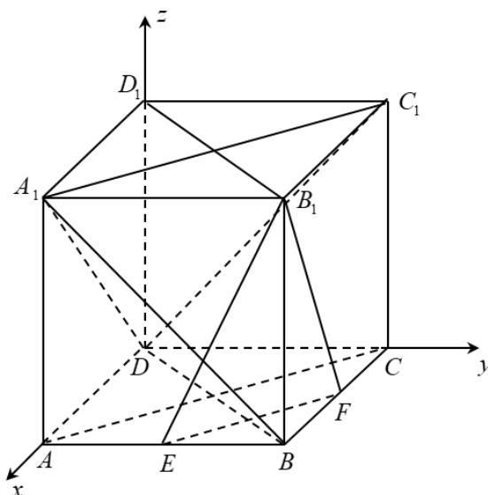

> [!faq]- 精品解析：2022年全国高考乙卷数学（理）试题（解析版）解析
>
> > [!success]- **【答案】** A
>
> > [!note]- **【分析】**
> > 证明 $EF \perp$ 平面 $BDD_{1}$ ，即可判断 A；如图，以点 D 为原点，建立空间直角坐标系，设 AB = 2，分别求出平面 $B_{1}EF$ ， $A_{1}BD$ ， $A_{1}C_{1}D$ 的法向量，根据法向量的位置关系，即可判断 BCD.
>
> > [!note]- **【解析】**
> > 解：在正方体 $ABCD - A_{1}B_{1}C_{1}D_{1}$ 中，
> >
> > $AC \perp BD$ 且 $DD_{1} \perp$ 平面 ABCD，
> >
> > 又 $EF \subset$ 平面ABCD，所以 $EF \perp DD_{1}$ ，
> >
> > 因为 E, F 分别为 AB, BC 的中点，
> >
> > 所以 $EF \parallel AC$ ，所以 $EF \perp BD$ ，
> >
> > 又 $BD \cap DD_{1} = D$
> >
> > 所以 $EF \perp$ 平面 $BDD_{1}$ ,
> >
> > 又 $EF \subset$ 平面 $B_{1}EF$ ，
> >
> > 所以平面 $B_{1}EF \perp$ 平面 $BDD_{1}$ ，故A正确；
> >
> > 如图，以点 $D$ 原点，建立空间直角坐标系，设 $AB = 2$ ，
> >
> > 则 $B_{1}(2,2,2),E(2,1,0),F(1,2,0),B(2,2,0),A_{1}(2,0,2),A(2,0,0),C(0,2,0)$
> >
> > $$
> > C _ {1} (0, 2, 2)
> > $$
> >
> > 则 $EF = (-1,1,0),EB_{1} = (0,1,2)$ ， $DB = (2,2,0),DA_{1} = (2,0,2)$
> >
> > $$
> > A A _ {1} = (0, 0, 2), A C = (- 2, 2, 0), A _ {1} C _ {1} = (- 2, 2, 0),
> > $$
> >
> > 设平面 $B_{1}EF$ 的法向量为 $m=(x_{1},y_{1},z_{1})$ ,
> >
> > 则有 $\left\{ \begin{array}{l} m \cdot EF = -x_1 + y_1 = 0 \\ m \cdot EB_1 = y_1 + 2z_1 = 0 \end{array} \right.$ ，可取 $m = (2, 2, -1)$ ，同理可得平面 $A_{1}BD$ 的法向量为 $n_{1}=(1,-1,-1)$ ,
> > 平面 $A_{1}AC$ 的法向量为 $n_{2}=(1,1,0)$ ,
> > 平面 $A_{1}C_{1}D$ 的法向量为 $n_{3}=(1,1,-1)$ ,
> > 则 $m \cdot n_{1} = 2 - 2 + 1 = 1 \neq 0$ 所以平面 $B_{1}EF$ 与平面 $A_{1}BD$ 不垂直，故 B 错误；
> > 因为 m 与 $n_{2}$ 不平行，
> > 所以平面 $B_{1}EF$ 与平面 $A_{1}AC$ 不平行，故 C 错误；
> > 因为 m 与 $n_{3}$ 不平行，
> > 所以平面 $B_{1}EF$ 与平面 $A_{1}C_{1}D$ 不平行，故 D 错误，
> > 故选：A.
> >
> > 
