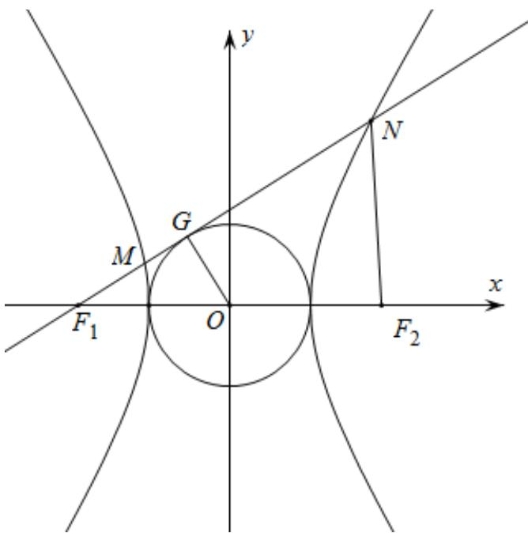

> [!faq]- 精品解析：2022年全国高考乙卷数学（理）试题（解析版）解析
>
> > [!success]- **【答案】** C
>
> > [!note]- **【分析】**
> > 依题意不妨设双曲线焦点在 $x$ 轴，设过 $F_{1}$ 作圆 $D$ 的切线切点为 $G$ ，可判断 $N$ 在双曲线的右支，设 $\angle F_{1}NF_{2} = \alpha$ ， $\angle F_{2}F_{1}N = \beta$ ，即可求出 $\sin \alpha$ ， $\sin \beta$ ， $\cos \beta$ ，在 $\triangle F_2F_1N$ 中由 $\sin \angle F_1F_2N = \sin (\alpha +\beta)$ 求出 $\sin \angle F_1F_2N$ ，再由正弦定理求出 $\left|NF_1\right|$ ， $\left|NF_2\right|$ ，最后根据双曲线的定义得到 $2b = 3a$ ，即可得解；
>
> > [!note]- **【解析】**
> > 解：依题意不妨设双曲线焦点在 $x$ 轴，设过 $F_{1}$ 作圆 $D$ 的切线切点为 $G$ ，所以 $OG \perp NF_{1}$ ，因为 $\cos \angle F_{1}NF_{2} = \frac{3}{5} > 0$ ，所以 $N$ 在双曲线的右支，所以 $|OG| = a$ ， $|OF_{1}| = c$ ， $|GF_{1}| = b$ ，设 $\angle F_{1}NF_{2} = \alpha$ ， $\angle F_{2}F_{1}N = \beta$ ，由 $\cos \angle F_{1}NF_{2} = \frac{3}{5}$ ，即 $\cos \alpha = \frac{3}{5}$ ，则 $\sin \alpha = \frac{4}{5}$ ， $\sin \beta = \frac{a}{c}$ ， $\cos \beta = \frac{b}{c}$ ，在 $\triangle F_{2}F_{1}N$ 中， $\sin \angle F_{1}F_{2}N = \sin (\pi - \alpha - \beta) = \sin (\alpha + \beta)$ $= \sin \alpha \cos \beta + \cos \alpha \sin \beta = \frac{4}{5} \times \frac{b}{c} + \frac{3}{5} \times \frac{a}{c} = \frac{3a + 4b}{5c}$ ，由正弦定理得 $\frac{2c}{\sin \alpha} = \frac{|NF_{2}|}{\sin \beta} = \frac{|NF_{1}|}{\sin \angle F_{1}F_{2}N} = \frac{5c}{2}$ ，所以 $|NF_{1}| = \frac{5c}{2}\sin \angle F_{1}F_{2}N = \frac{5c}{2} \times \frac{3a + 4b}{5c} = \frac{3a + 4b}{2}$ ， $|NF_{2}| = \frac{5c}{2}\sin \beta = \frac{5c}{2} \times \frac{a}{c} = \frac{5a}{2}$ 又 $|NF_{1}| - |NF_{2}| = \frac{3a + 4b}{2} - \frac{5a}{2} = \frac{4b - 2a}{2} = 2a$ ，所以 $2b = 3a$ ，即 $\frac{b}{a} = \frac{3}{2}$ ，所以双曲线的离心率 $e = \frac{c}{a} = \sqrt{1 + \frac{b^2}{a^2}} = \frac{\sqrt{13}}{2}$
> >
> > 
> >
> > 故选：C
