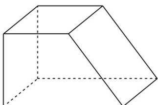

> [!faq]- 精品解析：2022年全国高考甲卷数学（理）试题（解析版）解析
>
> > [!success]- **【答案】** B
>
> > [!note]- **【分析】**
> > 由三视图还原几何体，再由棱柱的体积公式即可得解.
>
> > [!note]- **【解析】**
> > 由三视图还原几何体，如图，
> >
> > 
> >
> > 则该直四棱柱的体积 $V = \frac{2 + 4}{2} \times 2 \times 2 = 12$ .
> >
> > 故选：B.
