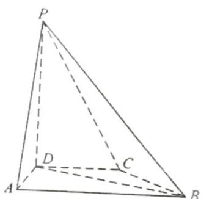

<!-- question-source:start -->
18. 在四棱锥 $P - ABCD$ 中， $PD \perp$ 底面

$ABCD, CD \parallel AB, AD = DC = CB = 1, AB = 2, DP = \sqrt{3}$ .

(1) 证明: $BD \perp PA$ ;

(2) 求 $PD$ 与平面 $PAB$ 所成的角的正弦值.
<!-- question-source:end -->

![[高中/真题/按年份分类/2022/精品解析_2022年全国高考甲卷数学_理_试题_解析版_/解答题/题目/answers/Q00020417A1.md]]
