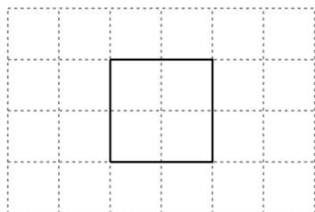
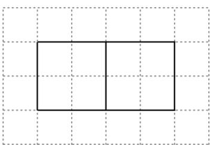

<!-- question-source:start -->
4. 如图，网格纸上绘制的是一个多面体的三视图，网格小正方形的边长为 1，则该多面体的体积为（）

A. 8 B. 12 C. 16 D. 20
<!-- question-source:end -->

![[高中/真题/按年份分类/2022/精品解析_2022年全国高考甲卷数学_理_试题_解析版_/选择题/题目/answers/Q00020403A1.md]]
