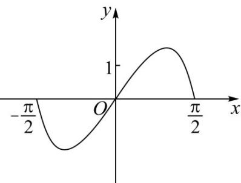
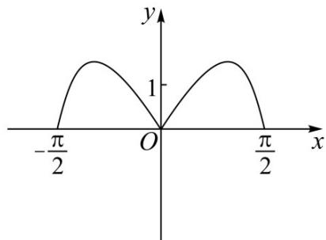
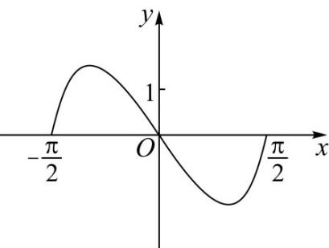
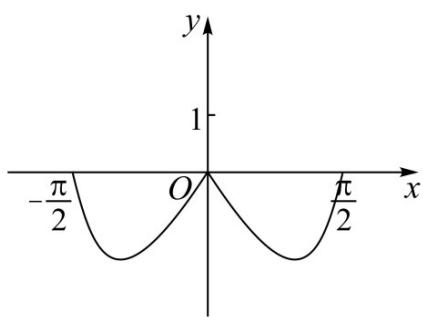

<!-- question-source:start -->
5. 函数 $y = \left(3^x - 3^{-x}\right) \cos x$ 在区间 $\left[-\frac{\pi}{2}, \frac{\pi}{2}\right]$ 的图象大致为（）

A.

B.

C.

D.

<!-- question-source:end -->

![[高中/真题/按年份分类/2022/精品解析_2022年全国高考甲卷数学_理_试题_解析版_/选择题/题目/answers/Q00020404A1.md]]
