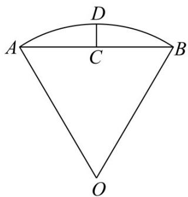

<!-- question-source:start -->
8. 沈括的《梦溪笔谈》是中国古代科技史上的杰作，其中收录了计算圆弧长度的“会圆术”，如图，AB 是以 O 为圆心，OA 为半径的圆弧，C 是的 AB 中点，D 在 AB 上， $CD \perp AB$ ．“会圆术”给出 AB 的弧长的近似值 s 的计算公式： $s = AB + \frac{CD^{2}}{OA}$ ．当 $OA = 2, \angle AOB = 60^{\circ}$ 时， $s = (\quad)$

A. $\frac{11 - 3\sqrt{3}}{2}$ B. $\frac{11 - 4\sqrt{3}}{2}$ C. $\frac{9 - 3\sqrt{3}}{2}$ D.

$$
\frac {9 - 4 \sqrt {3}}{2}
$$

【
<!-- question-source:end -->

![[高中/真题/按年份分类/2022/精品解析_2022年全国高考甲卷数学_理_试题_解析版_/选择题/题目/answers/Q00021459A1.md]]
