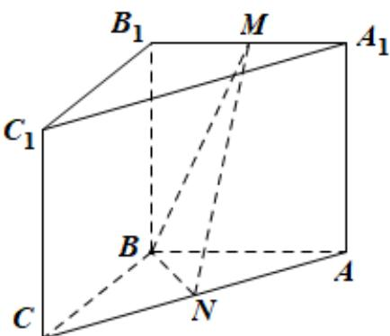

<!-- question-source:start -->
17. 如图，在三棱柱 $ABC - A_{1}B_{1}C_{1}$ 中，侧面 $BCC_{1}B_{1}$ 为正方形，平面 $BCC_{1}B_{1} \perp$ 平面 $ABB_{1}A_{1}$ ， $AB = BC = 2$ ， $M, N$ 分别为 $A_{1}B_{1}$ ， $AC$ 的中点。

<!-- question-source:end -->

![[高中/真题/按年份分类/2022/精品解析_2022年北京市高考数学试题_解析版_/解答题/题目/answers/Q00029278A1.md]]
