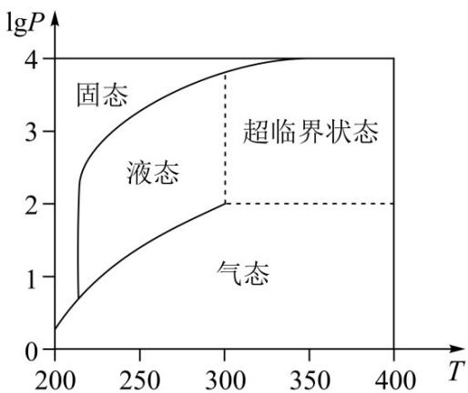

<!-- question-source:start -->
7. 在北京冬奥会上，国家速滑馆“冰丝带”使用高效环保的二氧化碳跨临界直冷制冰技术，为实现绿色冬奥作出了贡献。如图描述了一定条件下二氧化碳所处的状态与 $T$ 和 $\lg P$ 的关系，其中 $T$ 表示温度，单位是 $K; P$ 表示压强，单位是 bar。下列结论中正确的是（）

A.当 $T = 220$ ， $P = 1026$ 时，二氧化碳处于液态  
B.当 $T = 270$ ， $P = 128$ 时，二氧化碳处于气态  
C.当 $T = 300$ ， $P = 9987$ 时，二氧化碳处于超临界状态  
D.当 $T = 360$ ， $P = 729$ 时，二氧化碳处于超临界状态

【
<!-- question-source:end -->

![[高中/真题/按年份分类/2022/精品解析_2022年北京市高考数学试题_解析版_/选择题/题目/answers/Q00021348A1.md]]
