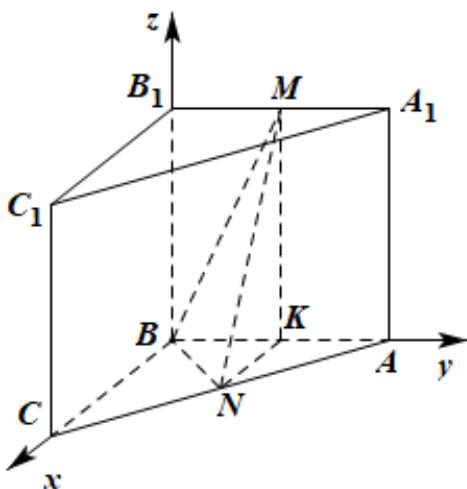

> [!faq]- 精品解析：2022年北京市高考数学试题（解析版）解析
>
> > [!success]- **【答案】** 详见解析
>
> > [!note]- **【分析】**
> > 本题未单列分析。
>
> > [!note]- **【解析】**
> > 取 AB 的中点为 K，连接 MK, NK，
> >
> > 由三棱柱 $ABC - A_{1}B_{1}C_{1}$ 可得四边形 $ABB_{1}A_{1}$ 为平行四边形，
> >
> > 而 $B_{1}M = MA_{1}, BK = KA$ ，则 $MK // BB_{1}$ ，
> >
> > 而 $MK \not\subset$ 平面 $CBB_{1}C_{1}$ ， $BB_{1} \subset$ 平面 $CBB_{1}C_{1}$ ，故 $MK \parallel$ 平面 $CBB_{1}C_{1}$ ，
> >
> > 而 $CN = NA, BK = KA$ ，则 $NK // BC$ ，同理可得 $NK // \text{平面} CBB_1C_1$ ，
> >
> > 而 $NK \cap MK = K, NK, MK \subset$ 平面 MKN，
> >
> > 故平面 $MKN \parallel$ 平面 $CBB_{1}C_{1}$ ，而 $MN \subset$ 平面 $MKN$ ，故 $MN \parallel$ 平面 $CBB_{1}C_{1}$ ，
> >
> > 小问 2
> >
> > 因为侧面 $CBB_{1}C_{1}$ 为正方形，故 $CB\perp BB_{1}$ ，
> >
> > 而 $CB \subset$ 平面 $CBB_{1}C_{1}$ ，平面 $CBB_{1}C_{1} \perp$ 平面 $ABB_{1}A_{1}$ ，
> >
> > 平面 $CBB_{1}C_{1}\cap$ 平面 $ABB_{1}A_{1}=BB_{1}$ ，故 $CB\perp$ 平面 $ABB_{1}A_{1}$ ，
> >
> > 因为 $NK // BC$ ，故 $NK \perp$ 平面 $ABB_{1}A_{1}$
> >
> > 因为 $AB\dot{1}$ 平面 $ABB_{1}A_{1}$ ，故 $NK \perp AB$ ，
> >
> > 若选①，则 $AB \perp MN$ ，而 $NK \perp AB$ ， $NK \cap MN = N$ ，
> >
> > 故 $AB \perp$ 平面 $MNK$ ，而 $MK \subset$ 平面 $MNK$ ，故 $AB \perp MK$ ，
> >
> > 所以 $AB \perp BB_{1}$ ，而 $CB \perp BB_{1}$ ， $CB \cap AB = B$ ，故 $BB_{1} \perp$ 平面 $ABC$ ，
> >
> > 故可建立如所示的空间直角坐标系，则 $B(0,0,0), A(0,2,0), N(1,1,0), M(0,1,2)$ ，
> >
> > 故 $BA = (0,2,0), BN = (1,1,0), BM = (0,1,2)$
> >
> > 设平面 BNM 的法向量为 $n=(x,y,z)$ ,
> >
> > 则 $\left\{ \begin{array}{l} n \cdot BN = 0 \\ n \cdot BM = 0 \end{array} \right.$ ，从而 $\left\{ \begin{array}{l} x + y = 0 \\ y + 2z = 0 \end{array} \right.$ ，取 $z = -1$ ，则 $n = (-2, 2, -1)$ ，
> >
> > 设直线 $AB$ 与平面 $BNM$ 所成的角为 $\theta$ ，则
> >
> > $$
> > \sin \theta = \left| \cos \langle n, A B \rangle \right| = \frac {4}{2 \times 3} = \frac {2}{3}.
> > $$
> >
> > 若选②，因 $NK // BC$ ，故 $NK \perp$ 平面 $ABB_{1}A_{1}$ ，而 $KM \subset$ 平面 $MKN$ ，故 $NK \perp KM$ ，而 $B_{1}M = BK = 1, NK = 1$ ，故 $B_{1}M = NK$ ，
> >
> > 而 $B_{1}B = MK = 2$ ， $MB = MN$ ，故 $\triangle BB_{1}M \cong \triangle MKN$ ，
> >
> > 所以 $\angle BB_{1}M = \angle MKN = 90^{\circ}$ ，故 $A_{1}B_{1} \perp BB_{1}$ ，
> >
> > 而 $CB \perp BB_{1}$ ， $CB \cap AB = B$ ，故 $BB_{1} \perp$ 平面 $ABC$ ，
> >
> > 故可建立如所示的空间直角坐标系，则 $B(0,0,0), A(0,2,0), N(1,1,0), M(0,1,2)$ ，故 $BA = (0,2,0), BN = (1,1,0), BM = (0,1,2)$ ，设平面 $BNM$ 的法向量为 $n = (x,y,z)$ ，
> >
> > 则 $\left\{ \begin{array}{l} n \cdot BN = 0 \\ n \cdot BM = 0 \end{array} \right.$ ，从而 $\left\{ \begin{array}{l} x + y = 0 \\ y + 2z = 0 \end{array} \right.$ ，取 $z = -1$ ，则 $n = (-2,2,-1)$ ，设直线 $AB$ 与平面 $BNM$ 所成的角为 $\theta$ ，则 $\sin \theta = |\cos \langle n, AB\rangle| = \frac{4}{2 \times 3} = \frac{2}{3}$ .
> >
> > 
