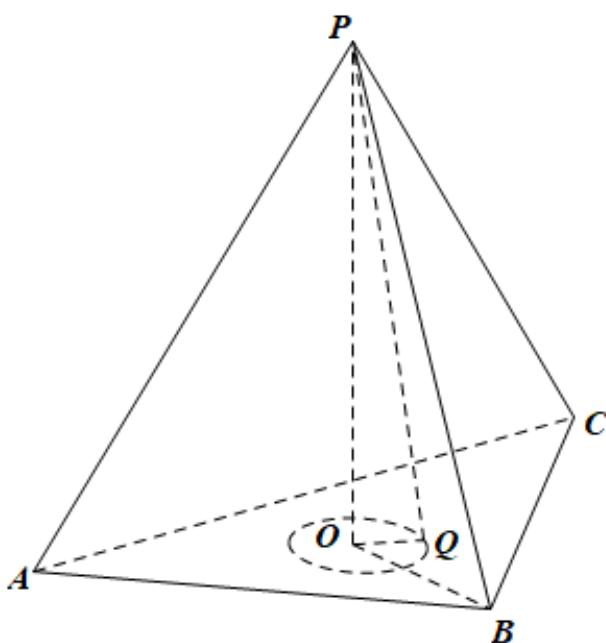

> [!faq]- 精品解析：2022年北京市高考数学试题（解析版）解析
>
> > [!success]- **【答案】** B
>
> > [!note]- **【分析】**
> > 求出以 P 为球心，5 为半径的球与底面 ABC 的截面圆的半径后可求区域的面积.
>
> > [!note]- **【解析】**
> > 
> >
> > 设顶点 $P$ 在底面上的投影为 $O$ ，连接 $BO$ ，则 $O$ 为三角形 $ABC$ 的中心，且 $BO = \frac{2}{3} \times 6 \times \frac{\sqrt{3}}{2} = 2\sqrt{3}$ ，故 $PO = \sqrt{36 - 12} = 2\sqrt{6}$ .
> >
> > 因为 PQ = 5 ，故 OQ = 1 ，
> >
> > 故 $S$ 的轨迹为以 $O$ 为圆心，1为半径的圆，
> >
> > 而三角形 内切圆的圆心为，半径为 $\frac{2\times\frac{\sqrt{3}}{4}\times36}{3\times6}=\sqrt{3}>1$
> >
> > 故S的轨迹圆在三角形ABC内部，故其面积为 $\pi$
> >
> > 故选：B
