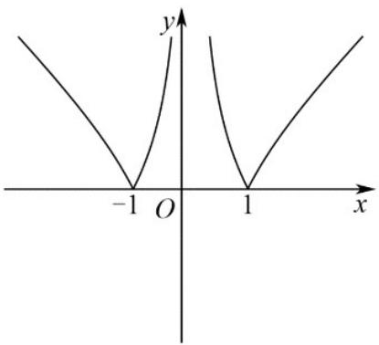
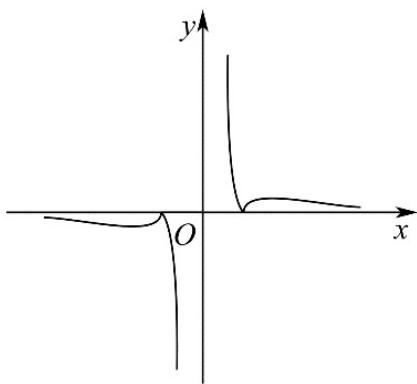
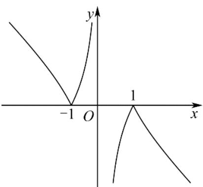
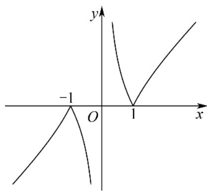

<!-- question-source:start -->
3. 函数 $f(x) = \frac{|x^2 - 1|}{x}$ 的图像为（）

A.

B.

C.

D.

<!-- question-source:end -->

![[高中/真题/按年份分类/2022/精品解析_2022年新高考天津数学高考真题_解析版_/一_选择题/题目/answers/Q00020448A1.md]]
