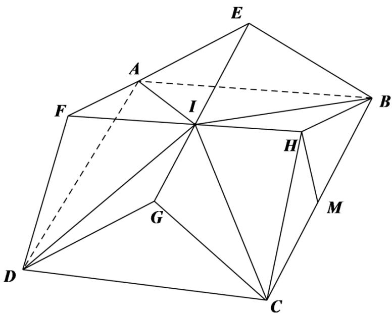

> [!faq]- 精品解析：2022年新高考天津数学高考真题（解析版）解析
>
> > [!success]- **【答案】** D
>
> > [!note]- **【分析】**
> > 作出几何体直观图，由题意结合几何体体积公式即可得组合体的体积.
>
> > [!note]- **【解析】**
> > 该几何体由直三棱柱 $AFD - BHC$ 及直三棱柱 $DGC - AEB$ 组成，作 $HM \perp CB$ 于 $M$ ，如图，因为 $CH = BH = 3, \angle CHB = 120^{\circ}$ ，所以 $CM = BM = \frac{3\sqrt{3}}{2}, HM = \frac{3}{2}$ ，
> >
> > 因为重叠后的底面为正方形，所以 $AB = BC = 3\sqrt{3}$ ，
> >
> > 在直棱柱 $AFD - BHC$ 中， $AB \perp$ 平面 $BHC$ ，则 $AB \perp HM$ ，
> >
> > 由 $AB \cap BC = B$ 可得 $HM \perp$ 平面 $ADCB$ ,
> >
> > 设重叠后的 $EG$ 与 $FH$ 交点为 $I$ ,
> >
> > 
> >
> > $$
> > V _ {I - B C D A} = \frac {1}{3} \times 3 \sqrt {3} \times 3 \sqrt {3} \times \frac {3}{2} = \frac {2 7}{2}, V _ {A F D - B H C} = \frac {1}{2} \times 3 \sqrt {3} \times \frac {3}{2} \times 3 \sqrt {3} = \frac {8 1}{4}
> > $$
> >
> > 则该几何体的体积为 $V = 2V_{AFD-BHC} - V_{I-BCDA} = 2 \times \frac{81}{4} - \frac{27}{2} = 27$ .
> >
> > 故选：D.
