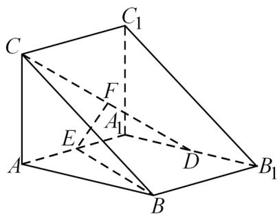

<!-- question-source:start -->
17. 直三棱柱 $ABC - A_{1}B_{1}C_{1}$ 中， $AA_{1} = AB = AC = 2, AA_{1} \perp AB, AC \perp AB$ ，D 为 $A_{1}B_{1}$ 的中点，E 为 $AA_{1}$

的中点， $F$ 为 $CD$ 的中点.

(1) 求证: $EF \parallel$ 平面 $ABC$ ;

(2) 求直线 $BE$ 与平面 $CC_{1}D$ 所成角的正弦值；

(3) 求平面 $A_{1}CD$ 与平面 $CC_{1}D$ 所成二面角的余弦值.
<!-- question-source:end -->

![[高中/真题/按年份分类/2022/精品解析_2022年新高考天津数学高考真题_解析版_/三_解答题/题目/answers/Q00020462A1.md]]
