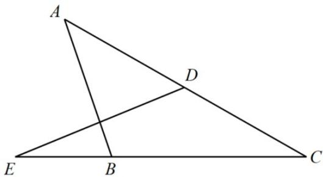
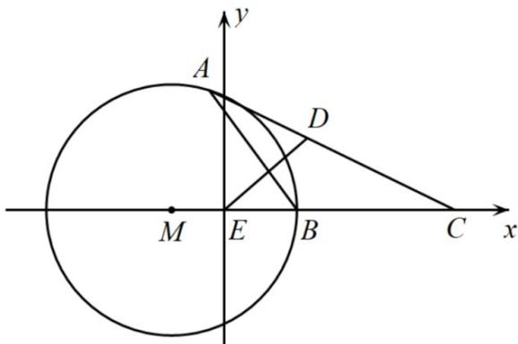

> [!faq]- 精品解析：2022年新高考天津数学高考真题（解析版）解析
>
> > [!success]- **【答案】** ①. $\frac{3}{2} b - \frac{1}{2} a$ ②. $\frac{\pi}{6}$
>
> > [!note]- **【分析】**
> > 法一：根据向量的减法以及向量的数乘即可表示出 $DE$ ，以 $\{a, b\}$ 为基底，表示出 $AB, DE$ ，由 $AB \perp DE$ 可得 $3b^2 + a^2 = 4b \cdot a$ ，再根据向量夹角公式以及基本不等式即可求出。
>
> > [!note]- **【解析】**
> > 方法一：
> >
> > 
> >
> > $$
> > D E = C E - C D = \frac {3}{2} b - \frac {1}{2} a, A B = C B - C A = b - a, A B \perp D E \Rightarrow (3 b - a) \cdot (b - a) = 0,
> > $$
> >
> > $\Rightarrow\cos\angle ACB=\frac{a\cdot b}{|a||b|}\equiv\frac{3b^{2}+a^{2}}{4|a||b|}\geq\frac{2\sqrt{3}|a||b|}{4|a||b|}=\frac{\sqrt{3}}{2}$ ，当且仅当 $|a|=\sqrt{3}|b|$ 时取等号，而
> >
> > $0 < \angle ACB < \pi$ ，所以 $\angle ACB \in (0, \frac{\pi}{6}]$
> >
> > 故答案为： $\frac{3}{2} b - \frac{1}{2} a;\frac{\pi}{6}.$
> >
> > 方法二：如图所示，建立坐标系：
> >
> > 
> >
> > $E(0,0),B(1,0),C(3,0),A(x,y),DE = (-\frac{x + 3}{2}, - \frac{y}{2}),AB = (1 - x, - y)$
> >
> > $DE \perp AB \Rightarrow (\frac{x + 3}{2})(x - 1) + \frac{y^2}{2} = 0 \Rightarrow (x + 1)^2 + y^2 = 4$ ，所以点 $\mathrm{A}$ 的轨迹是以 $M(-1,0)$ 为圆心，以
> >
> > $r = 2$ 为半径的圆，当且仅当 $CA$ 与 $\odot M$ 相切时， $\angle C$ 最大，此时 $\sin C = \frac{r}{CM} = \frac{2}{4} = \frac{1}{2}, \angle C = \frac{\pi}{6}$ .
> >
> > 故答案为： $\frac{3}{2}b-\frac{1}{2}a;\quad\frac{\pi}{6}$
