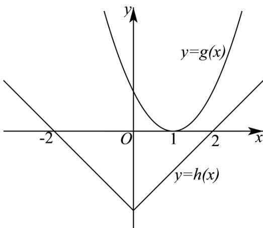
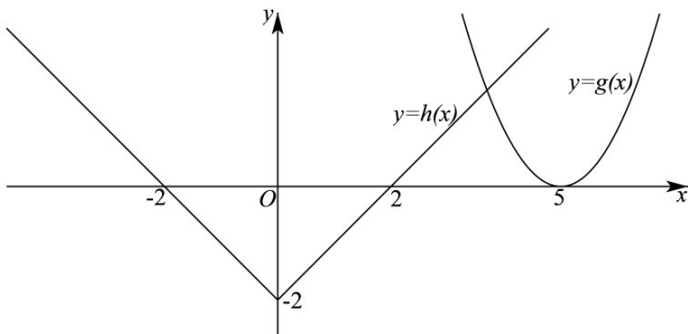

> [!faq]- 精品解析：2022年新高考天津数学高考真题（解析版）解析
>
> > [!success]- **【答案】** $\left[10,+\infty\right)$
>
> > [!note]- **【分析】**
> > 设 $g(x) = x^{2} - ax + 3a - 5$ ， $h(x) = |x| - 2$ ，分析可知函数 $g(x)$ 至少有一个零点，可得出 $\Delta \geq 0$ 求出 $a$ 的取值范围，然后对实数 $a$ 的取值范围进行分类讨论，根据题意可得出关于实数 $a$ 的不等式，综合
>
> > [!note]- **【解析】**
> > 设 $g(x) = x^{2} - ax + 3a - 5$ ， $h(x) = |x| - 2$ ，由 $|x| - 2 = 0$ 可得 $x = \pm 2$
> >
> > 要使得函数 $f(x)$ 至少有3个零点，则函数 $g(x)$ 至少有一个零点，则 $\Delta = a^2 - 12a + 20 \geq 0$
> >
> > 解得 $a \leq 2$ 或 $a \geq 10$ .
> >
> > ① 当 $a = 2$ 时， $g(x) = x^2 - 2x + 1$ ，作出函数 $g(x)$ 、 $h(x)$ 的图象如下图所示：
> >
> > 
> >
> > 此时函数 $f(x)$ 只有两个零点，不合乎题意；
> >
> > ② 当 a < 2 时，设函数 $g(x)$ 的两个零点分别为 $x_{1}$ 、 $x_{2}(x_{1} < x_{2})$ ,
> >
> > 要使得函数 $f(x)$ 至少有 3 个零点，则 $x_{2} \leq -2$ ，
> >
> > 所以， $\left\{ \begin{array}{l} \frac{a}{2} < -2 \\ g(-2) = 4 + 5a - 5 \geq 0 \end{array} \right.$ ，解得 $a \in \emptyset$
> >
> > ③ 当 $a = 10$ 时， $g(x) = x^2 - 10x + 25$ ，作出函数 $g(x)$ 、 $h(x)$ 的图象如下图所示：
> >
> > 
> >
> > 由图可知，函数 $f(x)$ 的零点个数为3，合乎题意；
> >
> > ④ 当 a > 10 时，设函数 $g(x)$ 的两个零点分别为 $x_{3}$ 、 $x_{4}(x_{3} < x_{4})$ ,
> >
> > 要使得函数 $f(x)$ 至少有 3 个零点，则 $x_{3} \geq 2$ ，
> >
> > 可得 $\left\{\begin{aligned}\frac{a}{2}&>2\\ g(2)&=4+a-5\geq0\end{aligned}\right.$ ，解得 \_\_\_\_，此时 \_\_\_\_。
> >
> > 综上所述，实数 $a$ 的取值范围是 $\left[10, +\infty\right)$ .
> >
> > 故答案为： $\left[10,+\infty\right)$ .
> >
> > 【点睛】方法点睛：已知函数有零点（方程有根）求参数值（取值范围）常用的方法：
