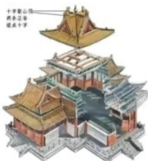
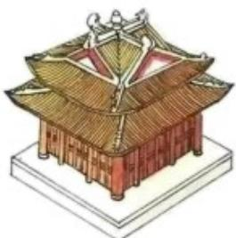

<!-- question-source:start -->
8. 如图, “十字歇山”是由两个直三棱柱重叠后的景象, 重叠后的底面为正方形, 直三棱柱的底面是顶角为 $120^{\circ}$ , 腰为 3 的等腰三角形, 则该几何体的体积为 ( )

  
十字歇山顶

A. 23 B. 24 C. 26 D. 27
<!-- question-source:end -->

![[高中/真题/按年份分类/2022/精品解析_2022年新高考天津数学高考真题_解析版_/选择题/题目/answers/Q00020453A1.md]]
