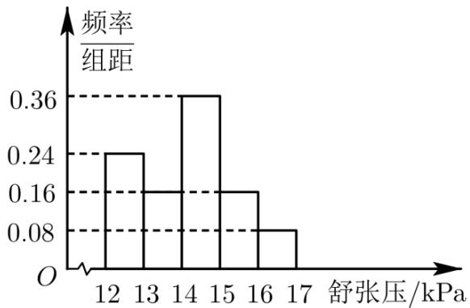

<!-- question-source:start -->
4. 为研究某药品的疗效，选取若干名志愿者进行临床试验，所有志愿者的舒张压数据（单位：kPa）的分组区间为 [12,13), [13,14), [14,15), [15,16), [16,17]，将其按从左到右的顺序分别编号为第一组，第二组，…，第五组，右图是根据试验数据制成的频率分布直方图。已知第一组与第二组共有20人，第三组中没有疗效的有6人，则第三组中有疗效的人数为（）
A. 8
B. 12
C. 16
D. 18

【
<!-- question-source:end -->

![[高中/真题/按年份分类/2022/精品解析_2022年新高考天津数学高考真题_解析版_/选择题/题目/answers/Q00021962A1.md]]
