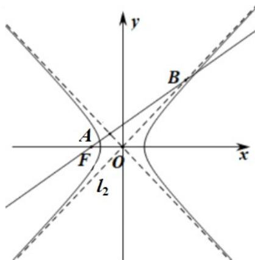

> [!faq]- 精品解析：2022年浙江省高考数学试题（解析版）解析
>
> > [!success]- **【答案】** $\frac{3\sqrt{6}}{4}$
>
> > [!note]- **【分析】**
> > 联立直线 AB 和渐近线 $l_{2}: y = \frac{b}{a}x$ 方程，可求出点 B，再根据 $|FB|=3|FA|$ 可求得点 A，最后根据点 A 在双曲线上，即可解出离心率。
>
> > [!note]- **【解析】**
> > 过 F 且斜率为 $\frac{b}{4a}$ 的直线 $AB: y = \frac{b}{4a}(x + c)$ ，渐近线 $l_{2}: y = \frac{b}{a}x$ ，
> > 联立 $\left\{\begin{aligned}y&=\frac{b}{4a}(x+c)\\ y&=\frac{b}{a}x\end{aligned}\right.$ ，得 $B\left(\frac{c}{3},\frac{bc}{3a}\right)$ ，由 $|FB|=3|FA|$ ，得 $A\left(-\frac{5c}{9},\frac{bc}{9a}\right)$ ，
> > 而点 A 在双曲线上，于是 $\frac{25c^{2}}{81a^{2}} - \frac{b^{2}c^{2}}{81a^{2}b^{2}} = 1$ ，解得： $\frac{c^{2}}{a^{2}} = \frac{81}{24}$ ，所以离心率 $e = \frac{3\sqrt{6}}{4}$ .
> > 故答案为： $\frac{3\sqrt{6}}{4}$ .
> >
> > 
