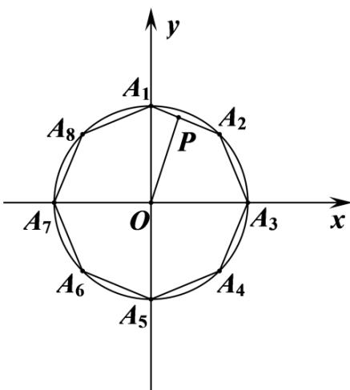

> [!faq]- 精品解析：2022年浙江省高考数学试题（解析版）解析
>
> > [!success]- **【答案】** $[12 + 2\sqrt{2},16]$
>
> > [!note]- **【分析】**
> > 根据正八边形的结构特征，分别以圆心为原点， $A_{7}A_{3}$ 所在直线为 x 轴， $A_{5}A_{1}$ 所在直线为 y 轴建立平面直角坐标系，即可求出各顶点的坐标，设 $P(x,y)$ ，再根据平面向量模的坐标计算公式即可得到 $PA_{1}^{2} + PA_{2}^{2} + \cdots + PA_{B}^{2} = 8(x^{2} + y^{2}) + 8$ ，然后利用 $\cos 22.5^{\circ} \neq OP \leq 1$ 即可解出.
>
> > [!note]- **【解析】**
> > 以圆心为原点， $A_{7}A_{3}$ 所在直线为 x 轴， $A_{5}A_{1}$ 所在直线为 y 轴建立平面直角坐标系，如图所示：
> >
> > 
> >
> > 则 $A_{1}(0,1), A_{2}\left(\frac{\sqrt{2}}{2}, \frac{\sqrt{2}}{2}\right), A_{3}(1,0), A_{4}\left(\frac{\sqrt{2}}{2}, -\frac{\sqrt{2}}{2}\right), A_{5}(0,-1), A_{6}\left(-\frac{\sqrt{2}}{2}, -\frac{\sqrt{2}}{2}\right), A_{7}(-1,0)$ ,
> >
> > $A_{8}\left(-\frac{\sqrt{2}}{2},\frac{\sqrt{2}}{2}\right)$ ，设 $P(x,y)$ ，于是 $PA_{1}^{2}+PA_{2}^{2}+\cdots+PA_{8}^{2}=8(x^{2}+y^{2})+8$
> >
> > 因为 $\cos22.5^{\circ}\leq OP\mid\leq1$ ，所以 $\frac{1+\cos45^{\circ}}{2}\leq x^{2}+y^{2}\leq1$ ，故 $PA_{1}^{2}+PA_{2}^{2}+\cdots+PA_{8}^{2}$ 的取值范围是 $[12+2\sqrt{2},16]$ .
> >
> > 故答案为： $[12 + 2\sqrt{2},16]$
> >
> > ##
