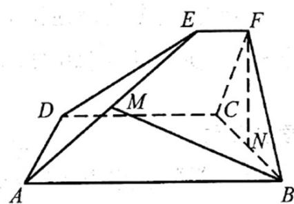

<!-- question-source:start -->
19. 如图，已知 ABCD 和 CDEF 都是直角梯形，AB // DC，DC // EF，AB = 5，DC = 3，EF = 1， $\angle BAD = \angle CDE = 60^{\circ}$ ，二面角 F - DC - B 的平面角为 $60^{\circ}$ ．设 M，N 分别为 AE, BC 的中点.

<!-- question-source:end -->

![[高中/真题/按年份分类/2022/精品解析_2022年浙江省高考数学试题_解析版_/解答题/题目/answers/Q00029289A1.md]]
