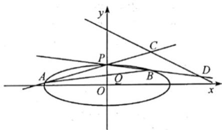

<!-- question-source:start -->
21. 如图，已知椭圆 $\frac{x^2}{12} + y^2 = 1$ 。设 $A, B$ 是椭圆上异于 $P(0,1)$ 的两点，且点 $Q\left(0, \frac{1}{2}\right)$ 在线段 $AB$ 上，直线 $PA, PB$ 分别交直线 $y = -\frac{1}{2} x + 3$ 于 $C, D$ 两点。

(1) 求点 P 到椭圆上点的距离的最大值;

(2) 求 $\left| CD \right|$ 的最小值.
<!-- question-source:end -->

![[高中/真题/按年份分类/2022/精品解析_2022年浙江省高考数学试题_解析版_/解答题/题目/answers/Q00030457A1.md]]
