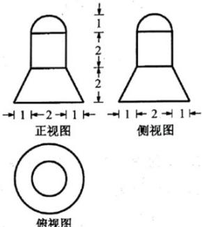

<!-- question-source:start -->
5. 某几何体的三视图如图所示（单位：cm），则该几何体的体积（单位： $\mathrm{cm}^3$ ）是（）

  
俯视图

A. $22\pi$ B. $8\pi$ C. $\frac{22}{3}\pi$ D. $\frac{16}{3}\pi$

【
<!-- question-source:end -->

![[高中/真题/按年份分类/2022/精品解析_2022年浙江省高考数学试题_解析版_/选择题/题目/answers/Q00021388A1.md]]
