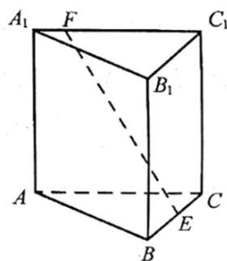

<!-- question-source:start -->
8. 如图，已知正三棱柱 $ABC - A_{1}B_{1}C_{1}, AC = AA_{1}$ ， $E$ ， $F$ 分别是棱 $BC, A_{1}C_{1}$ 上的点。记 $EF$ 与 $AA_{1}$ 所成的角为 $\alpha$ ， $EF$ 与平面 $ABC$ 所成的角为 $\beta$ ，二面角 $F - BC - A$ 的平面角为 $\gamma$ ，则（）

A. $\alpha \leq \beta \leq \gamma$ B. $\beta \leq \alpha \leq \gamma$ C. $\beta \leq \gamma \leq \alpha$ D.

$\alpha \leq \gamma \leq \beta$

【
<!-- question-source:end -->

![[高中/真题/按年份分类/2022/精品解析_2022年浙江省高考数学试题_解析版_/选择题/题目/answers/Q00021391A1.md]]
