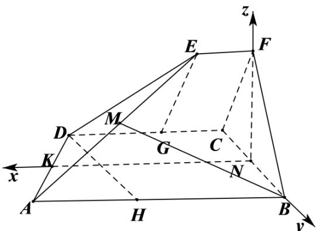

> [!faq]- 精品解析：2022年浙江省高考数学试题（解析版）解析
>
> > [!success]- **【答案】** 详见解析
>
> > [!note]- **【分析】**
> > 本题未单列分析。
>
> > [!note]- **【解析】**
> > 过点 E 、 D 分别做直线 DC 、 AB 的垂线 EG 、 DH 并分别交于点交于点 G 、 H .
> >
> > ∵四边形 ABCD 和 EFCD 都是直角梯形， $AB \parallel DC, CD \parallel EF, AB = 5, DC = 3, EF = 1$ ， $\angle BAD = \angle CDE = 60^{\circ}$ ，由平面几何知识易知，
> >
> > $DG = AH = 2, \angle EFC = \angle DCF = \angle DCB = \angle ABC = 90^{\circ}$ ，则四边形 $EFCG$ 和四边形 $DCBH$ 是矩形，∴在 Rt△EGD 和 Rt△DHA， $EG = DH = 2\sqrt{3}$ ，
> >
> > $\because DC \perp CF, DC \perp CB$ ，且 $CF \cap CB = C$ ，
> >
> > $\therefore DC \perp$ 平面 $BCF, \angle BCF$ 是二面角 $F - DC - B$ 的平面角，则 $\angle BCF = 60^{\circ}$ ，
> >
> > $\therefore \triangle BCF$ 是正三角形，由 $DC \subset$ 平面 $ABCD$ ，得平面 $ABCD \perp$ 平面 $BCF$
> >
> > $\because N$ 是 $BC$ 的中点， $\therefore FN\perp BC$ ，又 $DC\perp$ 平面 $BCF$ ， $FN\subset$ 平面 $BCF$ ，可得 $FN\perp CD$ ，而 $BC\cap CD = C$ ， $\therefore FN\perp$ 平面ABCD，而 $AD\subset$ 平面
> >
> > ABCD∴FN⊥AD.
> >
> > 【
> >
> > 小问 2
> >
> > 因为 $FN \perp$ 平面 $ABCD$ ，过点 $N$ 做 $AB$ 平行线 $NK$ ，所以以点 $N$ 为原点， $NK$ ， $NB$ 、 $NF$ 所在直线分别为 $x$ 轴、 $y$ 轴、 $z$ 轴建立空间直角坐标系 $N - xyz$ ，
> >
> > 设 $A(5,\sqrt{3},0),B(0,\sqrt{3},0),D(3, - \sqrt{3},0),E(1,0,3)$ ，则 $M\left(3,\frac{\sqrt{3}}{2},\frac{3}{2}\right)$
> >
> > $$
> > \therefore B M = \left(3, - \frac {\sqrt {3}}{2}, \frac {3}{2}\right), A D = (- 2, - 2 \sqrt {3}, 0), D E = (- 2, \sqrt {3}, 3)
> > $$
> >
> > 设平面 ADE 的法向量为 $n=(x,y,z)$
> >
> > 由 $\left\{ \begin{array}{l} n \cdot AD = 0 \\ n \cdot DE = 0 \end{array} \right.$ ，得 $\left\{ \begin{array}{l} -2x - 2\sqrt{3}y = 0 \\ -2x + \sqrt{3}y + 3z = 0 \end{array} \right.$ ，取 $n = (\sqrt{3}, -1, \sqrt{3})$
> >
> > 设直线 BM 与平面 ADE 所成角为 $\theta$ ，
> >
> > $$
> > \therefore \sin \theta = \left| \cos \langle n, B M \rangle \right| = \frac {\stackrel {\rightarrow} {| n - B M |}}{| n | \cdot B M |} = \frac {\left| 3 \sqrt {3} + \frac {\sqrt {3}}{2} + \frac {3 \sqrt {3}}{2} \right|}{\sqrt {3 + 1 + 3} \cdot \sqrt {9 + \frac {3}{4} + \frac {9}{4}}} = \frac {5 \sqrt {3}}{\sqrt {7} \cdot 2 \sqrt {3}} = \frac {5 \sqrt {7}}{1 4}.
> > $$
> >
> > 
