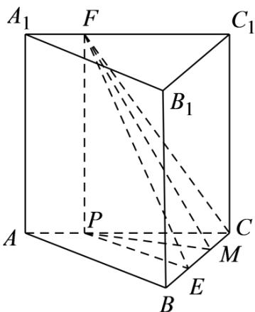

> [!faq]- 精品解析：2022年浙江省高考数学试题（解析版）解析
>
> > [!success]- **【答案】** A
>
> > [!note]- **【分析】**
> > 先用几何法表示出 $\alpha, \beta, \gamma$ ，再根据边长关系即可比较大小.
>
> > [!note]- **【解析】**
> > 如图所示，过点 $F$ 作 $FP \perp AC$ 于 $P$ ，过 $P$ 作 $PM \perp BC$ 于 $M$ ，连接 $PE$ ，
> >
> > 
> >
> > 则 $\alpha=\angle EFP,\beta=\angle FEP,\gamma=FMP,$
> >
> > $\tan \alpha = \frac{PE}{FP} = \frac{PE}{AB} \leq 1, \tan \beta = \frac{FP}{PE} = \frac{AB}{PE} \geq 1, \tan \gamma = \frac{FP}{PM} \geq \frac{FP}{PE} = \tan \beta,$
> >
> > 所以 $\alpha \leq \beta \leq \gamma$
> >
> > 故选：A.
