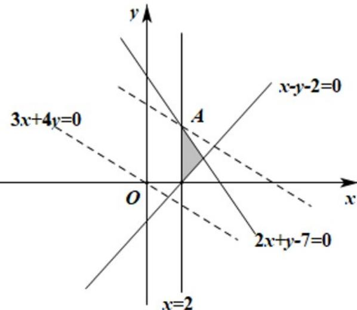

> [!faq]- 精品解析：2022年浙江省高考数学试题（解析版）解析
>
> > [!success]- **【答案】** B
>
> > [!note]- **【分析】**
> > 在平面直角坐标系中画出可行域，平移动直线 $z = 3x + 4y$ 后可求最大值.
>
> > [!note]- **【解析】**
> > 不等式组对应的可行域如图所示：
> >
> > 
> >
> > 当动直线 $3x + 4y - z = 0$ 过A时 $\mathbf{z}$ 有最大值.
> >
> > 由 $\left\{ \begin{array}{l}x = 2\\ 2x + y - 7 = 0 \end{array} \right.$ 可得 $\left\{ \begin{array}{l}x = 2\\ y = 3 \end{array} \right.$ ，故 $A(2,3)$
> >
> > 故 $z_{\max}=3\times2+4\times3=18$ ，
> >
> > 故选：B.
