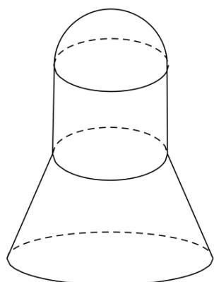

> [!faq]- 精品解析：2022年浙江省高考数学试题（解析版）解析
>
> > [!success]- **【答案】** C
>
> > [!note]- **【分析】**
> > 根据三视图还原几何体可知，原几何体是一个半球，一个圆柱，一个圆台组合成的几何体，即可根据球，圆柱，圆台的体积公式求出.
>
> > [!note]- **【解析】**
> > 由三视图可知，该几何体是一个半球，一个圆柱，一个圆台组合成的几何体，球的半径，圆柱的底面半径，圆台的上底面半径都为1 cm，圆台的下底面半径为2 cm，所以该几何体的体积
> >
> > $$
> > V = \frac {1}{2} \times \frac {4}{3} \pi \times 1 ^ {3} + \pi \times 1 ^ {2} \times 2 + \frac {1}{3} \times 2 \times \left(\pi \times 2 ^ {2} + \pi \times 1 ^ {2} + \sqrt {\pi \times 2 ^ {2} \times \pi \times 1 ^ {2}}\right) = \frac {2 2 \pi}{3} \mathrm{cm} ^ {3}.
> > $$
> >
> > 
> >
> > 故选：C.
