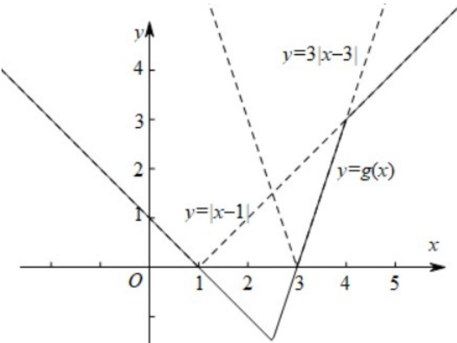

> [!faq]- 精品解析：2022年浙江省高考数学试题（解析版）解析
>
> > [!success]- **【答案】** D
>
> > [!note]- **【分析】**
> > 将问题转换为 $a|x - b|\geqslant 2x - 5| - |x - 4|$ ，再结合画图求解.
>
> > [!note]- **【解析】**
> > 由题意有：对任意的 $x \in \mathbf{R}$ ，有 $a|x - b| \geqslant 2x - 5| - |x - 4|$ 恒成立.
> >
> > 设， $g(x) = |2x - 5| - |x - 4| = \left\{ \begin{array}{l}1 - x,x\leq \frac{5}{2}\\ 3x - 9,\frac{5}{2} <  x <   4,\\ x - 1,x\geq 4 \end{array} \right.$
> >
> > 即 $f(x)$ 的图象恒在 $g(x)$ 的上方（可重合），如下图所示：
> >
> > 
> >
> > 由图可知， $a \geq 3, \quad 1 \leq b \leq 3$ ，或 $1 \leq a < 3, \quad 1 \leq b \leq 4 - \frac{3}{a} \leq 3$ ，
> >
> > 故选：D.
