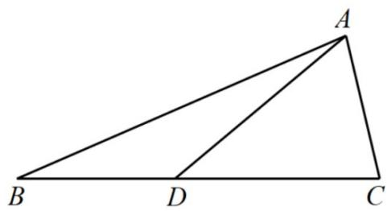
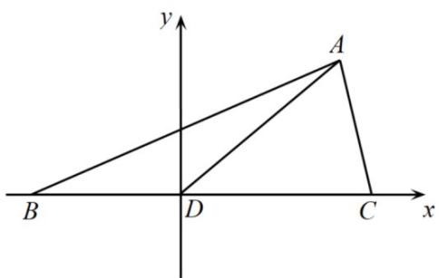

> [!faq]- 精品解析：2022年高考全国甲卷数学（文）真题（解析版）解析
>
> > [!success]- **【答案】** $\sqrt{3} - 1 \# \# - 1 + \sqrt{3}$
>
> > [!note]- **【分析】**
> > 设 $CD = 2BD = 2m > 0$ ，利用余弦定理表示出 $\frac{AC^2}{AB^2}$ 后，结合基本不等式即可得解.
>
> > [!note]- **【解析】**
> > [方法一]：余弦定理
> >
> > 设 $CD = 2BD = 2m > 0$
> >
> > $$
> > \text {则在} \triangle A B D _ {\text {中}}, A B ^ {2} = B D ^ {2} + A D ^ {2} - 2 B D \cdot A D \cos \angle A D B = m ^ {2} + 4 + 2 m,
> > $$
> >
> > 在 $\triangle ACD$ 中， $AC^2 = CD^2 +AD^2 -2CD\cdot AD\cos \angle ADC = 4m^2 +4 - 4m$
> >
> > $$
> > \text {所以} \frac {A C ^ {2}}{A B ^ {2}} = \frac {4 m ^ {2} + 4 - 4 m}{m ^ {2} + 4 + 2 m} = \frac {4 (m ^ {2} + 4 + 2 m) - 1 2 (1 + m)}{m ^ {2} + 4 + 2 m} = 4 - \frac {1 2}{(m + 1) + \frac {3}{m + 1}}
> > $$
> >
> > $$
> > \geq 4 - \frac {1 2}{2 \sqrt {(m + 1) \cdot \frac {3}{m + 1}}} = 4 - 2 \sqrt {3},
> > $$
> >
> > 当且仅当 $m + 1 = \frac{3}{m + 1}$ 即 $m = \sqrt{3} - 1$ 时，等号成立，
> >
> > 所以当 $\frac{AC}{AB}$ 取最小值时， $m = \sqrt{3} - 1$ .
> >
> > 故答案为： $\sqrt{3} - 1$
> >
> > 
> >
> > 
> >
> > [方法二]: 建系法
> >
> > 令 BD=t，以 D 为原点，OC 为 x 轴，建立平面直角坐标系.
> >
> > 则 C $(2t,0)$ ，A $(1,\sqrt{3})$ ，B $(-t,0)$
> >
> > $$
> > \therefore \frac {A C ^ {2}}{A B ^ {2}} = \frac {(2 t - 1) ^ {2} + 3}{(t + 1) ^ {2} + 3} = \frac {4 t ^ {2} - 4 t + 4}{t ^ {2} + 2 t + 4} = 4 - \frac {1 2}{(t + 1) + \frac {3}{t + 1}} \geq 4 - 2 \sqrt {3}
> > $$
> >
> > 当且仅当 $t+1=\sqrt{3}$ ，即 $BD=\sqrt{3}-1$ 时等号成立。
> >
> > ## [方法三]：余弦定理
> >
> > 设 BD=x, CD=2x. 由余弦定理得
> >
> > $$
> > \left\{ \begin{array}{l} c ^ {2} = x ^ {2} + 4 + 2 x \\ b ^ {2} = 4 + 4 x ^ {2} - 4 x, \therefore 2 c ^ {2} + b ^ {2} = 1 2 + 6 x ^ {2}, \end{array} \right.
> > $$
> >
> > $$
> > \left\{ \begin{array}{l} c ^ {2} = x ^ {2} + 4 + 2 x \\ b ^ {2} = 4 + 4 x ^ {2} - 4 x, \therefore 2 c ^ {2} + b ^ {2} = 1 2 + 6 x ^ {2}, \end{array} \right.
> > $$
> >
> > 令 $\frac{AC}{AB} = t$ ，则 $2c^{2} + t^{2}c^{2} = 12 + 6x^{2}$
> >
> > $$
> > \therefore t ^ {2} + 2 = \frac {1 2 + 6 x ^ {2}}{c ^ {2}} = \frac {1 2 + 6 x ^ {2}}{x ^ {2} + 2 x + 4} = 6 \left(1 - \frac {2}{(x + 1) + \frac {3}{x + 1}}\right) \geq 6 - 2 \sqrt {3},
> > $$
> >
> > $$
> > \therefore t ^ {2} \geq 4 - 2 \sqrt {3},
> > $$
> >
> > 当且仅当 $x + 1 = \frac{3}{x + 1}$ ，即 $x = \sqrt{3} +1$ 时等号成立.
> >
> > ## [方法四]：判别式法
> >
> > 设 $BD = x$ ，则 $CD = 2x$
> >
> > $$
> > \text {在} \triangle A B D _ {\text {中}}, A B ^ {2} = B D ^ {2} + A D ^ {2} - 2 B D \cdot A D \cos \angle A D B = x ^ {2} + 4 + 2 x,
> > $$
> >
> > $$
> > \text {在} \triangle A C D _ {\text {中}}, A C ^ {2} = C D ^ {2} + A D ^ {2} - 2 C D \cdot A D \cos \angle A D C = 4 x ^ {2} + 4 - 4 x,
> > $$
> >
> > 所以 $\frac{AC^2}{AB^2} = \frac{4x^2 + 4 - 4x}{x^2 + 4 + 2x}$ ，记 $t = \frac{4x^2 + 4 - 4x}{x^2 + 4 + 2x}$ ，
> >
> > 则 $(4 - t)x^{2} - (4 + 2t)x + (4 - 4t) = 0$
> >
> > 由方程有解得： $\Delta = (4 + 2t)^2 -4(4 - t)(4 - 4t)\geq 0$
> >
> > 即 $t^2 - 8t + 4 \leq 0$ ，解得： $4 - 2\sqrt{3} \leq t \leq 4 + 2\sqrt{3}$
> >
> > 所以 $t_{\min}=4-2\sqrt{3}$ ，此时 $x=\frac{2+t}{4-t}=\sqrt{3}-1$
> >
> > 所以当 $\frac{AC}{AB}$ 取最小值时， $x = \sqrt{3} - 1$ ，即 $BD = \sqrt{3} - 1$ .
