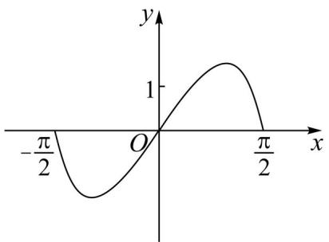
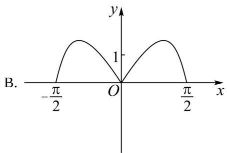
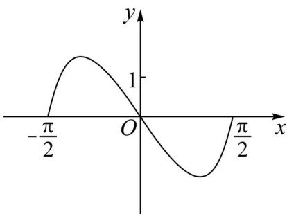
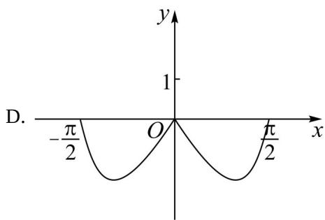

<!-- question-source:start -->
7. 函数 $y = (3^x - 3^{-x})\cos x$ 在区间 $\left[-\frac{\pi}{2}, \frac{\pi}{2}\right]$ 的图象大致为（）

A.  

C.  

D.

<!-- question-source:end -->

![[高中/真题/按年份分类/2022/精品解析_2022年高考全国甲卷数学_文_真题_解析版_/选择题/题目/answers/Q00020429A1.md]]
