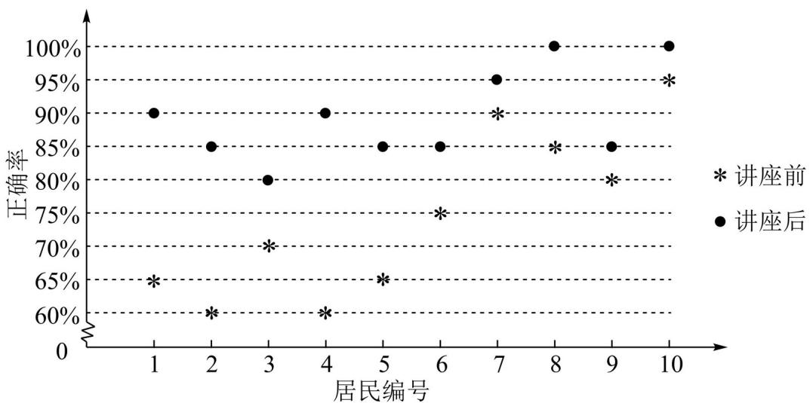

<!-- question-source:start -->
2. 某社区通过公益讲座以普及社区居民的垃圾分类知识。为了解讲座效果，随机抽取 10 位社区居民，让他们在讲座前和讲座后各回答一份垃圾分类知识问卷，这 10 位社区居民在讲座前和讲座后问卷答题的正确率如下图：

则（）
A. 讲座前问卷答题的正确率的中位数小于 $70\%$ B. 讲座后问卷答题的正确率的平均数大于 $85\%$ C. 讲座前问卷答题的正确率的标准差小于讲座后正确率的标准差
D. 讲座后问卷答题的正确率的极差大于讲座前正确率的极差

【
<!-- question-source:end -->

![[高中/真题/按年份分类/2022/精品解析_2022年高考全国甲卷数学_文_真题_解析版_/选择题/题目/answers/Q00021476A1.md]]
