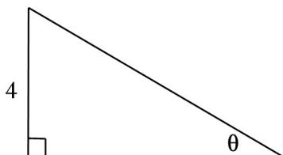

> [!faq]- 2023年上海高考数学真题（解析卷）解析
>
> > [!success]- **【答案】** 为： $\theta=\arccos\frac{40}{41}$ .  【点评】本题主要考查生活的应用问题，求函数的导数，利用导数研究函数的最值是解决本题的关键，是中档题.
>
> > [!note]- **【分析】**
> > 先求出斜坡的长度，求出上坡所消耗的总体力的函数关系，求出函数的导数，利用导数研究函数的最值即可.
>
> > [!note]- **【解析】**
> > 分析】先求出斜坡的长度，求出上坡所消耗的总体力的函数关系，求出函数的导数，利用导数研究函数的最值即可.
> >
> > 【
> > 解答】解：斜坡的长度为 $l = \frac{4}{\sin\theta}$ ，
> >
> > 上坡所消耗的总体力 $y = \frac{4}{\sin\theta} \times (1.025 - \cos \theta) = \frac{4.1 - 4\cos\theta}{\sin\theta}$ ,
> >
> > 函数的导数 $y' = \frac{4\sin\theta \cdot \sin\theta - (4.1 - 4\cos\theta) \cos\theta}{\sin^2\theta} = \frac{4 - 4.1\cos\theta}{\sin^2\theta}$ ,
> >
> > 由 $y' = 0$ ，得 $4 - 4.1\cos \theta = 0$ ，得 $\cos \theta = \frac{40}{41}$ ， $\theta = \arccos \frac{40}{41}$ ，
> >
> > 由 $f'(x) > 0$ 时 $\cos \theta < \frac{40}{41}$ ，即 $\arccos \frac{40}{41} < \theta < \frac{\pi}{2}$ 时，函数单调递增，
> >
> > 由 $f'(x) < 0$ 时 $\cos \theta > \frac{40}{41}$ ，即 $0 < \theta < \arccos \frac{40}{41}$ 时，函数单调递减，
> >
> > 即 $\theta = \arccos \frac{40}{41}$ ，函数取得最小值，即此时所消耗的总体力最小.
> >
> > 故
> > 答案为： $\theta=\arccos\frac{40}{41}$ .
> >
> > 
> >
> > 【点评】本题主要考查生活的应用问题，求函数的导数，利用导数研究函数的最值是解决本题的关键，是中档题.
