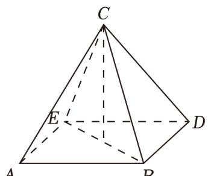
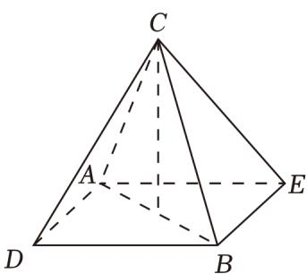

> [!faq]- 2023年上海高考数学真题（解析卷）解析
>
> > [!success]- **【答案】** 9
>
> > [!note]- **【分析】**
> > 根据正四棱锥的性质，分类讨论，即可求解.
>
> > [!note]- **【解析】**
> > 解：如图所示，设任取2个不同的点为 $D$ 、 $E$ ，
> >
> > 
> >
> > 
> >
> > 当 $\triangle ABC$ 为正四棱锥的侧面时，如图，平面 $ABC$ 的两侧分别可以做 $ABDE$ 作为圆锥的底面，有2种情况，
> >
> > 同理以 BCED、ACED 为底面各有 2 种情况，所以共有 6 种情况；
> >
> > 当 $\triangle ABC$ 为正四棱锥的截面时，如图， $D$ 、 $E$ 位于 $AB$ 两侧， $ADBE$ 为圆锥的底面，只有一种情况，
> >
> > 同理以 BDCE、ADCE 为底面各有 1 种情况，所以共有 3 种情况；
> >
> > 综上，共有 $6+3=9$ 种情况.
> >
> > 故答案为：9.
> >
> > 【点评】本题考查正四棱锥的性质，分类讨论思想，属中档题.
> >
> > ##
> > 二、选择题（本大题共有4题，满分18分，第13-14题每题4分，第15-16题每题5分）
> >
> > ## 每题有且只有一个正确答案，考生应在答题纸的相应位置，将代表正确选项的小方格涂黑.
