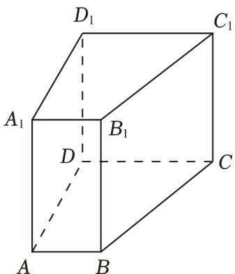

<!-- question-source:start -->
17. （14分）已知直四棱柱 $ABCD - A_{1}B_{1}C_{1}D_{1}$ ， $AB \perp AD$ ， $AB\|CD$ ， $AB = 2$ ， $AD = 3$ ， $CD = 4$ .

(1) 证明: 直线 $A_{1} B \parallel$ 平面 $D C C_{1} D_{1}$ ;

(2) 若该四棱柱的体积为 36，求二面角 $A_{1} - BD - A$ 的大小.

<!-- question-source:end -->

![[高中/真题/按年份分类/2023/2023年上海高考数学真题_解析卷_/解答题/题目/answers/Q00022685A1.md]]
