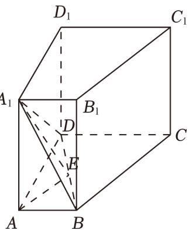

> [!faq]- 2023年上海高考数学真题（解析卷）解析
>
> > [!success]- **【答案】** 详见解析
>
> > [!note]- **【分析】**
> > （1）先证明平面 $A_{1}ABB_{1}$ 平面 $DCC_{1}D_{1}$ ，再根据面面平行的性质，即可证明；
>
> > [!note]- **【解析】**
> > 分析】（1）先证明平面 $A_{1}ABB_{1}$ 平面 $DCC_{1}D_{1}$ ，再根据面面平行的性质，即可证明；
> >
> > (2) 先根据体积建立方程求出 $A_{1} A = 4$ ，再利用三垂线定理作出所求二面角的平面角，最后再解三角形，即可求解.
> >
> > 【
> > 解答】解：（1）证明：根据题意可知 $AB\| DC$ ， $AA_{1}\| DD_{1}$ ，且 $AB\cap AA_{1} = A$ ∴可得平面 $A_{1}ABB_{1}\|$ 平面 $DCC_{1}D_{1}$ ，又直线 $A_{1}B\subset$ 平面 $A_{1}ABB_{1}$ ∴直线 $A_{1}B\|$ 平面 $DCC_{1}D_{1}$ ；
> >
> > (2) 设 $AA_{1} = h$ ，则根据题意可得该四棱柱的体积为 $\frac{1}{2} \times (2 + 4) \times 3 \times h = 36$ ， $\therefore h = 4$ ， $\because A_{1}A \perp$ 底面ABCD，在底面ABCD内过A作AE⊥BD，垂足点为E，则 $A_{1}E$ 在底面ABCD内的射影为AE，
> >
> > ∴根据三垂线定理可得 $BD \perp A_{1}E$ ,
> >
> > 故 $\angle A_{1}EA$ 即为所求，
> >
> > 在 Rt△ABD 中，AB=2，AD=3，∴BD= $\sqrt{4+9}=\sqrt{13}$ ，
> >
> > $\therefore AE = \frac{AB\times AD}{BD} = \frac{2\times 3}{\sqrt{13}} = \frac{6}{\sqrt{13}}$ ，又 $A_{1}A = h = 4,$
> >
> > $$
> > \therefore \tan \angle A _ {1} E A = \frac {\mathrm{A} _ {1} \mathrm{A}}{\mathrm{AE}} = \frac {\frac {4}{6}}{\frac {\sqrt {1 3}}{3}} = \frac {2 \sqrt {1 3}}{3},
> > $$
> >
> > ∴二面角 $A_{1}-BD-A$ 的大小为 $\arctan\frac{2\sqrt{13}}{3}$ .
> >
> > 
> >
> > 【点评】本题考查线面平行的证明，面面平行的判定定理与性质，二面角的求解，三垂线定理作二面角，化归转化思想，属中档题.
