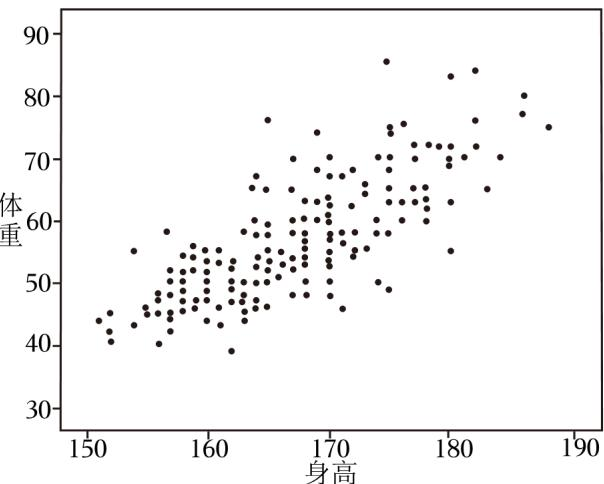

<!-- question-source:start -->
14. （4分）根据所示的散点图，下列说法正确的是（）

A. 身高越大，体重越大 B. 身高越大，体重越小 C. 身高和体重成正相关 D. 身高和体重成负相关
<!-- question-source:end -->

![[高中/真题/按年份分类/2023/2023年上海高考数学真题_解析卷_/选择题/题目/answers/Q00022682A1.md]]
