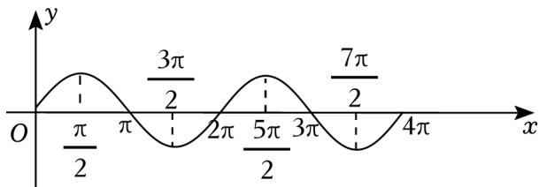

> [!faq]- 2023年上海高考数学真题（解析卷）解析
>
> > [!success]- **【答案】** D
>
> > [!note]- **【分析】**
> > 由题意可知 a > 0，对 a 分别求值，排除 ABC，即可得答案.
>
> > [!note]- **【解析】**
> > 解：由给定区间可知，a>0.
> >
> > 区间 $[a, 2a]$ 与区间 $[2a, 3a]$ 相邻，且区间长度相同.
> >
> > 
> >
> > 取 $a = \frac{\pi}{6}$ ，则 $[a, 2a] = \left[\frac{\pi}{6}, \frac{\pi}{3}\right]$ ，区间 $[2a, 3a] = \left[\frac{\pi}{3}, \frac{\pi}{2}\right]$ ，可知 $s_a > 0$ ， $t_a > 0$ ，故 $A$ 可能；  
> > 取 $a = \frac{5\pi}{12}$ ，则 $[a, 2a] = \left[\frac{5\pi}{12}, \frac{5\pi}{6}\right]$ ，区间 $[2a, 3a] = \left[\frac{5\pi}{6}, \frac{5\pi}{4}\right]$ ，可知 $s_a > 0$ ， $t_a < 0$ ，故 $C$ 可能；  
> > 取 $a = \frac{7\pi}{6}$ ，则 $[a, 2a] = \left[\frac{7\pi}{6}, \frac{7\pi}{3}\right]$ ，区间 $[2a, 3a] = \left[\frac{7\pi}{3}, \frac{7\pi}{2}\right]$ ，可知 $s_a < 0$ ， $t_a < 0$ ，故 $B$ 可能。  
> > 结合选项可得，不可能的是 $s_a < 0$ ， $t_a > 0$ 。
> >
> > 故选：D.
