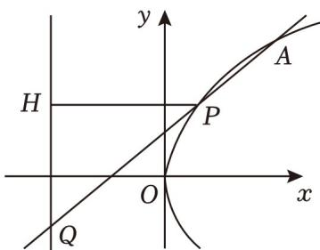

> [!faq]- 2023年上海高考数学真题（解析卷）解析
>
> > [!success]- **【答案】** （18分）已知抛物线 $\Gamma: y^2 =
>
> > [!note]- **【分析】**
> > （1）根据题意可得点 A 的横坐标为 2，将其代入抛物线的方程，即可求得 a 的值；
> > (2) 易知 $A(4, 4)$ , 设 $B(b, 0)$ , 由 $AB$ 的中点在抛物线上, 可得 $b$ 的值, 进而得到直线 $AB$ 的方程, 再由点到直线的距离公式得解;
> > (3) 设 $P\left(\frac{t^2}{4}, t\right), A\left(\frac{a^2}{4}, a\right), H(-3, t) (t \neq a)$ ，表示出直线 $AP$ 的方程，进一步表示出点 $Q$ 的坐标，再根据 $|HQ| > 4$ 恒成立，结合基本不等式即可得到 $a$ 的范围。
>
> > [!note]- **【解析】**
> > 解：
> > （1）抛物线 $\Gamma: y^2 = 4x$ 的准线为 $x = -1$ ，
> >
> > 由于 A 到抛物线 $\Gamma$ 准线的距离为 3，
> >
> > 则点 A 的横坐标为 2，则 $a^{2}=4\times2=8\quad(a>0)$ ，
> >
> > 解得 $a = 2\sqrt{2}$ ;
> > (2) 当 $a = 4$ 时，点 $A$ 的横坐标为 $\frac{4^2}{4} = 4$ ，则 $A(4, 4)$ ，
> >
> > 设 $B(b,0)$ ，则 $AB$ 的中点为 $(\frac{b + 4}{2},2)$
> >
> > 由题意可得 $2^{2} = 4 \times \frac{b + 4}{2}$ ，解得 $b = -2$
> >
> > 所以 $B(-2,0)$ ，
> >
> > 则 $k_{AB}=\frac{4-0}{4+2}=\frac{2}{3}$ ,
> >
> > 由点斜式可得，直线 $AB$ 的方程为 $\mathbf{y} = \frac{2}{3} (\mathbf{x} + 2)$ ，即 $2x - 3y + 4 = 0$
> >
> > 所以原点 O 到直线 AB 的距离为 $\frac{4}{\sqrt{2^{2}+3^{2}}}=\frac{4\sqrt{13}}{13}$ ;
> > (3) 如图，
> >
> > 
> >
> > 设 $P\left(\frac{t^{2}}{4}, t\right)$ ， $A\left(\frac{a^{2}}{4}, a\right)$ ， $H(-3, t) (t \neq a > 0)$ ，则 $k_{AP} = \frac{t - a}{\frac{t^{2}}{4} - \frac{a^{2}}{4}} = \frac{4}{t + a}$
> >
> > 故直线 $AP$ 的方程为 $\mathrm{y - a} = \frac{4}{\mathrm{t + a}}\left(\mathrm{x - }\frac{\mathrm{a}^2}{4}\right)$
> >
> > 令 $x = -3$ ，可得 $\mathrm{y = a - (\frac{a^2}{4} + 3)\cdot\frac{4}{t + a}}$ ，即 $Q(-3,a - (\frac{a^2}{4} +3)\cdot \frac{4}{t + a})$
> >
> > 则 $|\mathrm{HQ}| = |\mathrm{t - a} + \left(\frac{\mathrm{a}^2}{4} +3\right)\cdot \frac{4}{\mathrm{t + a}}|$
> >
> > 依题意， $\left|t-a+\left(\frac{a^{2}}{4}+3\right)\cdot\frac{4}{t+a}\right|>4$ 恒成立，
> >
> > $$
> > \text {又} _ {\mathrm{t+a+} \left(\frac {\mathrm{a} ^ {2}}{4} + 3\right) \cdot \frac {4}{\mathrm{t+a}} - 2 \mathrm{a} \geqslant 4 \sqrt {\frac {\mathrm{a} ^ {2}}{4} + 3} - 2 \mathrm{a} > 0},
> > $$
> >
> > 则最小值为 $4\sqrt{\frac{a^2}{4} + 3} - 2a > 4$ ，即 $2\sqrt{\frac{a^2}{4} + 3} > 2 + a$ ，即 $\sqrt{a^2 + 12} > 2 + a$
> >
> > 则 $a^2 + 12 > a^2 + 4a + 4$ ，解得 $0 < a < 2$
> >
> > 又当 $a = 2$ 时， $t + 2 + \frac{16}{t + 2} - 4 \geqslant 2\sqrt{(t + 2) \cdot \frac{16}{t + 2}} - 4 = 4$ ，当且仅当 $t = 2$ 时等号成立，
> >
> > $$
> > a = t
> > $$
> >
> > $$
> > a = 2
> > $$
> >
> > 故实数 a 的取值范围为 $(0, 2]$ .
