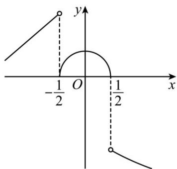
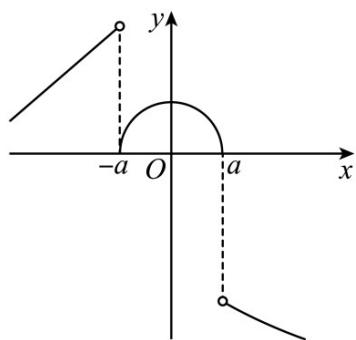
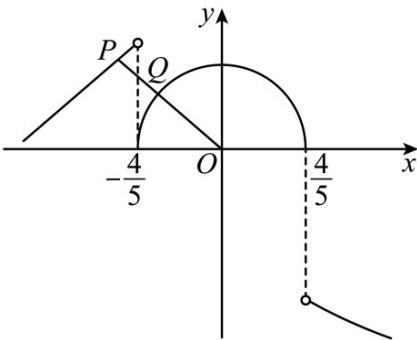

> [!faq]- 精品解析：2023年北京高考数学真题（解析版）解析
>
> > [!success]- **【答案】** ②③
>
> > [!note]- **【分析】**
> > 先分析 $f(x)$ 的图像，再逐一分析各结论；对于①，取 $a = \frac{1}{2}$ ，结合图像即可判断；对于②，分
>
> > [!note]- **【解析】**
> > 依题意，a > 0，
> >
> > 当 $x < -a$ 时， $f(x) = x + 2$ ，易知其图像为一条端点取不到值的单调递增的射线；
> >
> > 当 $-a \leq x \leq a$ 时， $f(x) = \sqrt{a^2 - x^2}$ ，易知其图像是，圆心为 $(0,0)$ ，半径为 $a$ 的圆在 $x$ 轴上方的图像（即半圆）；
> >
> > 当 $x > a$ 时， $f(x) = -\sqrt{x} - 1$ ，易知其图像是一条端点取不到值的单调递减的曲线；
> >
> > 对于①，取 $a = \frac{1}{2}$ ，则 $f(x)$ 的图像如下，
> >
> > 
> >
> > 显然，当 $x \in (a - 1, +\infty)$ ，即 $x \in \left(-\frac{1}{2}, +\infty\right)$ 时， $f(x)$ 在 $\left(-\frac{1}{2}, 0\right)$ 上单调递增，故①错误；
> >
> > 对于②，当 $a \geq 1$ 时，
> >
> > 当 $x < -a$ 时， $f(x) = x + 2 < -a + 2 \leq 1$ ；
> >
> > 当 $-a\leq x\leq a$ 时， $f(x) = \sqrt{a^2 - x^2}$ 显然取得最大值 $a$
> >
> > 当 $x > a$ 时， $f(x) = -\sqrt{x} - 1 < -\sqrt{a} - 1 \leq -2$
> >
> > 综上： $f(x)$ 取得最大值 a，故②正确；
> >
> > 对于③，结合图像，易知在 $x_{1} = a$ ， $x_{2} > a$ 且接近于 $x = a$ 处，
> >
> > $M(x_{1},f(x_{1}))(x_{1}\leq a),N(x_{2},f(x_{2}))(x_{2}>a)$ 的距离最小，
> >
> > 
> >
> > 当 $x_{1} = a$ 时， $y = f(x_{1}) = 0$ ，当 $x_{2} > a$ 且接近于 $x = a$ 处， $y_{2} = f(x_{2}) < -\sqrt{a} - 1$
> >
> > 此时， $\left|MN\right|>y_{1}-y_{2}>\sqrt{a}+1>1$ ，故③正确；
> >
> > 对于④，取 $a = \frac{4}{5}$ ，则 $f(x)$ 的图像如下，
> >
> > 
> >
> > 因为 $P(x_{3}, f(x_{3}))(x_{3} < -a), Q(x_{4}, f(x_{4}))(x_{4} \geq -a)$ ,
> >
> > 结合图像可知，要使 $|PQ|$ 取得最小值，则点 $P$ 在 $f(x)=x+2\left(x<-\frac{4}{5}\right)$ 上，点Q在
> >
> > $$
> > f (x) = \sqrt {\frac {1 6}{2 5} - x ^ {2}} \left(- \frac {4}{5} \leq x \leq \frac {4}{5}\right)
> > $$
> >
> > 同时 $|PQ|$ 的最小值为点O到 $f(x)=x+2\left(x<-\frac{4}{5}\right)$ 的距离减去半圆的半径 $_{a}$ ，
> >
> > 此时，因为 $f(x) = y = x + 2\left(x < -\frac{4}{5}\right)$ 的斜率为1，则 $k_{OP} = -1$ ，故直线 $OP$ 的方程为 $y = -x$
> >
> > 联立 $\left\{ \begin{array}{l} y = -x \\ y = x + 2 \end{array} \right.$ ，解得 $\left\{ \begin{array}{l} x = -1 \\ y = 1 \end{array} \right.$ ，则 $P(-1,1)$ ，
> >
> > 显然 $P(-1,1)$ 在 $f(x) = x + 2\left(x < -\frac{4}{5}\right)$ 上，满足 $\left|PQ\right|$ 取得最小值，
> >
> > 即 $a = \frac{4}{5}$ 也满足 $\left|PQ\right|$ 存在最小值，故 $a$ 的取值范围不仅仅是 $\left(0, \frac{1}{2}\right]$ ，故④错误.
> >
> > 故答案为：②③.
> >
> > 【点睛】关键点睛：本题解决的关键是分析得 $f(x)$ 的图像，特别是当 $-a \leq x \leq a$ 时， $f(x) = \sqrt{a^{2} - x^{2}}$ 的图像为半圆，解决命题④时，可取特殊值进行排除即可.
> >
> > ##
