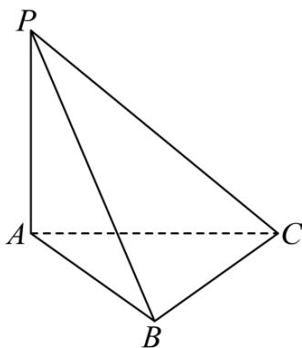

<!-- question-source:start -->
16. 如图，在三棱锥 $P - ABC$ 中， $PA \perp$ 平面 $ABC$ ， $PA = AB = BC = 1, PC = \sqrt{3}$ 。

<!-- question-source:end -->

![[高中/真题/按年份分类/2023/精品解析_2023年北京高考数学真题_解析版_/解答题/题目/answers/Q00029307A1.md]]
