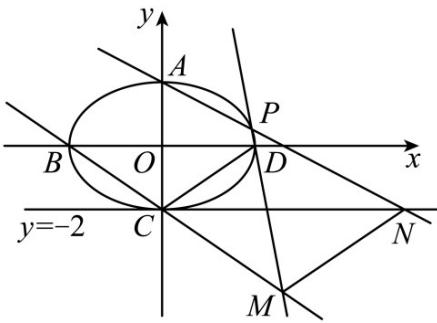

> [!faq]- 精品解析：2023年北京高考数学真题（解析版）解析
>
> > [!success]- **【答案】** （1） $\frac{x^{2}}{9}+\frac{y^{2}}{4}=1$ (2) 证明见
>
> > [!note]- **【分析】**
> > （1）结合题意得到 $\frac{c}{a} = \frac{\sqrt{5}}{3}$ ， $2b = 4$ ，再结合 $a^2 - c^2 = b^2$ ，解之即可；
> > (2) 依题意求得直线 BC、PD 与 PA 的方程，从而求得点 M, N 的坐标，进而求得 $k_{MN}$ ，再根据题意求得 $k_{CD}$ ，得到 $k_{MN} = k_{CD}$ ，由此得解.
>
> > [!note]- **【解析】**
> > 依题意，得 $e = \frac{c}{a} = \frac{\sqrt{5}}{3}$ ，则 $c = \frac{\sqrt{5}}{3} a$
> >
> > 又 $A, C$ 分别为椭圆上下顶点， $|AC| = 4$ ，所以 $2b = 4$ ，即 $b = 2$ ，
> >
> > 所以 $a^2 - c^2 = b^2 = 4$ ，即 $a^2 - \frac{5}{9} a^2 = \frac{4}{9} a^2 = 4$ ，则 $a^2 = 9$ ，
> >
> > 所以椭圆 $E$ 的方程为 $\frac{x^2}{9} +\frac{y^2}{4} = 1$
> >
> > 【
> >
> > 小问 2
> >
> > 因为椭圆 $E$ 的方程为 $\frac{x^2}{9} +\frac{y^2}{4} = 1$ ，所以 $A(0,2),C(0, - 2),B(-3,0),D(3,0)$
> >
> > 因为 $P$ 为第一象限 $E$ 上的动点，设 $P(m,n)(0 < m < 3,0 < n < 2)$ ，则 $\frac{m^2}{9} +\frac{n^2}{4} = 1$
> >
> > 
> >
> > 易得 $k_{BC}=\frac{0+2}{-3-0}=-\frac{2}{3}$ ，则直线 BC 的方程为 $y=-\frac{2}{3}x-2$ ，
> >
> > $k_{PD}=\frac{n-0}{m-3}=\frac{n}{m-3}$ ，则直线PD的方程为 $y=\frac{n}{m-3}(x-3)$ ，
> >
> > 联立 $\left\{ \begin{array}{l} y = -\frac{2}{3} x - 2 \\ y = \frac{n}{m - 3} (x - 3) \end{array} \right.$ ，解得 $\left\{ \begin{array}{l} x = \frac{3(3n - 2m + 6)}{3n + 2m - 6} \\ y = \frac{-12n}{3n + 2m - 6} \end{array} \right.$ ，即 $M\left(\frac{3(3n - 2m + 6)}{3n + 2m - 6}, \frac{-12n}{3n + 2m - 6}\right)$ ，
> >
> > 而 $k_{PA} = \frac{n - 2}{m - 0} = \frac{n - 2}{m}$ ，则直线 $PA$ 的方程为 $y = \frac{n - 2}{m} x + 2$
> >
> > 令 $y = -2$ ，则 $-2 = \frac{n - 2}{m} x + 2$ ，解得 $x = \frac{-4m}{n - 2}$ ，即 $N\left(\frac{-4m}{n - 2}, - 2\right)$
> >
> > 又 $\frac{m^2}{9} +\frac{n^2}{4} = 1$ ，则 $m^2 = 9 - \frac{9n^2}{4}$ ， $8m^{2} = 72 - 18n^{2}$
> >
> > $$
> > k _ {M N} = \frac {\frac {- 1 2 n}{3 n + 2 m - 6} + 2}{\frac {3 (3 n - 2 m + 6)}{3 n + 2 m - 6} - \frac {- 4 m}{n - 2}} = \frac {(- 6 n + 4 m - 1 2) (n - 2)}{(9 n - 6 m + 1 8) (n - 2) + 4 m (3 n + 2 m - 6)}
> > $$
> >
> > $$
> > = \frac {- 6 n ^ {2} + 4 m n - 8 m + 2 4}{9 n ^ {2} + 8 m ^ {2} + 6 m n - 1 2 m - 3 6} = \frac {- 6 n ^ {2} + 4 m n - 8 m + 2 4}{9 n ^ {2} + 7 2 - 1 8 n ^ {2} + 6 m n - 1 2 m - 3 6}
> > $$
> >
> > $$
> > = \frac {- 6 n ^ {2} + 4 m n - 8 m + 2 4}{- 9 n ^ {2} + 6 m n - 1 2 m + 3 6} = \frac {2 (- 3 n ^ {2} + 2 m n - 4 m + 1 2)}{3 (- 3 n ^ {2} + 2 m n - 4 m + 1 2)} = \frac {2}{3},
> > $$
> >
> > 又 $k_{CD}=\frac{0+2}{3-0}=\frac{2}{3}$ ，即 $k_{MN}=k_{CD}$ ，
> >
> > 显然，MN 与 CD 不重合，所以 MN // CD.
