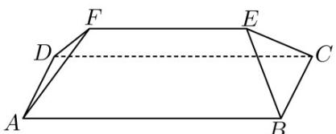

<!-- question-source:start -->
9. 坡屋顶是我国传统建筑造型之一，蕴含着丰富的数学元素。安装灯带可以勾勒出建筑轮廓，展现造型之美。如图，某坡屋顶可视为一个五面体，其中两个面是全等的等腰梯形，两个面是全等的等腰三角形。若 $AB = 25\mathrm{m}, BC = AD = 10\mathrm{m}$ ，且等腰梯形所在的平面、等腰三角形所在的平面与平面 $ABCD$ 的夹角的正

切值均为 $\frac{\sqrt{14}}{5}$ ，则该五面体的所有棱长之和为（）

A. $102\mathrm{m}$ B. $112\mathrm{m}$

C. $117\mathrm{m}$ D. $125\mathrm{m}$

【
<!-- question-source:end -->

![[高中/真题/按年份分类/2023/精品解析_2023年北京高考数学真题_解析版_/选择题/题目/answers/Q00022384A1.md]]
