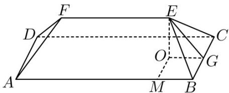

> [!faq]- 精品解析：2023年北京高考数学真题（解析版）解析
>
> > [!success]- **【答案】** C
>
> > [!note]- **【分析】**
> > 先根据线面角的定义求得 $\tan\angle EMO=\tan\angle EGO=\frac{\sqrt{14}}{5}$ ，从而依次求 EO，EG，EB，EF，
> > 再把所有棱长相加即可得解.
>
> > [!note]- **【解析】**
> > 如图，过 $E$ 做 $EO \perp$ 平面ABCD，垂足为 $O$ ，过 $E$ 分别做 $EG \perp BC$ ， $EM \perp AB$ ，垂足分别
> >
> > 为 $G$ ， $M$ ，连接 $OG,OM$ ，
> >
> > 
> >
> > 由题意得等腰梯形所在的面、等腰三角形所在的面与底面夹角分别为 $\angle EMO$ 和 $\angle EGO$
> >
> > 所以 $\tan\angle EMO=\tan\angle EGO=\frac{\sqrt{14}}{5}$ .
> >
> > 因为 $EO \perp$ 平面 ABCD， $BC \subset$ 平面 ABCD，所以 $EO \perp BC$ ，
> >
> > 因为 $EG \perp BC$ ， $EO, EG \subset$ 平面 $EOG$ ， $EO \cap EG = E$
> >
> > 所以 $BC \perp$ 平面 $EOG$ ，因为 $OG \subset$ 平面 $EOG$ ，所以 $BC \perp OG$ ，.
> >
> > 同理： $OM\perp BM$ ，又 $BM\perp BG$ ，故四边形OMBG是矩形，
> >
> > 所以由 $BC = 10$ 得 $OM = 5$ ，所以 $EO = \sqrt{14}$ ，所以 $OG = 5$
> >
> > 所以在直角三角形 $EOG$ 中， $EG = \sqrt{EO^2 + OG^2} = \sqrt{\left(\sqrt{14}\right)^2 + 5^2} = \sqrt{39}$
> >
> > 在直角三角形 $EBG$ 中， $BG = OM = 5$ ， $EB = \sqrt{EG^2 + BG^2} = \sqrt{(\sqrt{39})^2 + 5^2} = 8$ ，
> >
> > 又因为 EF = AB - 5 - 5 = 25 - 5 - 5 = 15，
> >
> > 所有棱长之和为 $2 \times 25 + 2 \times 10 + 15 + 4 \times 8 = 117\mathrm{m}$ .
> >
> > 故选：C
