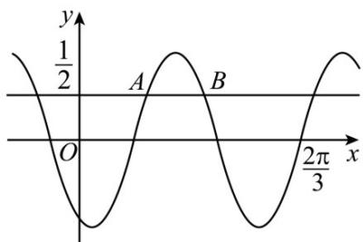

<!-- question-source:start -->
16. 已知函数 $f(x)=\sin(\omega x+\varphi)$ ，如图 A, B 是直线 $y=\frac{1}{2}$ 与曲线 $y=f(x)$ 的两个交点，若 $\left|AB\right|=\frac{\pi}{6}$ ，
则 $f(\pi)=$ \_\_\_\_.

【
<!-- question-source:end -->

![[高中/真题/按年份分类/2023/精品解析_2023年新课标全国Ⅱ卷数学真题_解析版_/填空题/题目/answers/Q00022662A1.md]]
