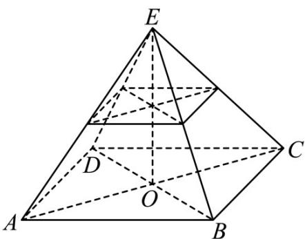

> [!faq]- 精品解析：2023年新课标全国Ⅱ卷数学真题（解析版）解析
>
> > [!success]- **【答案】** 28
>
> > [!note]- **【分析】**
> > 方法一：割补法，根据正四棱锥的几何性质以及棱锥体积公式求得正确答案；方法二：根据台体的体积公式直接运算求解.
>
> > [!note]- **【解析】**
> > 方法一：由于 $4 \sim 2$ ，而截去的正四棱锥的高为3，所以原正四棱锥的高为6，
> >
> > $$
> > \frac {2}{4} = \frac {1}{2}
> > $$
> >
> > 所以正四棱锥的体积为 $\frac{1}{3} \times (4 \times 4) \times 6 = 32$ ，
> >
> > 截去的正四棱锥的体积为 $\frac{1}{3} \times (2 \times 2) \times 3 = 4$ ，
> >
> > 所以棱台的体积为 $32 - 4 = 28$
> >
> > 方法二：棱台的体积为 $\frac{1}{3} \times 3 \times (16 + 4 + \sqrt{16 \times 4}) = 28$
> >
> > 故答案为：28.
> >
> > 
