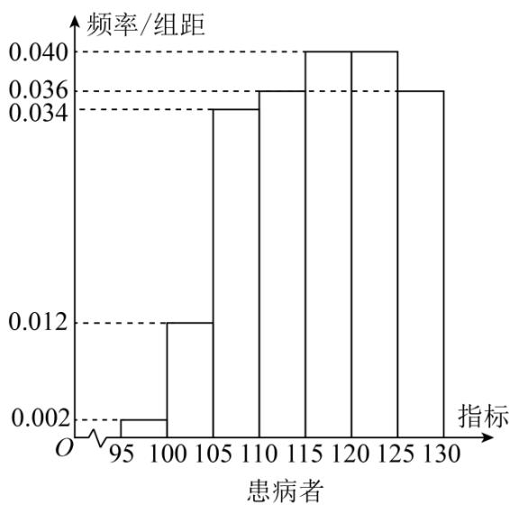
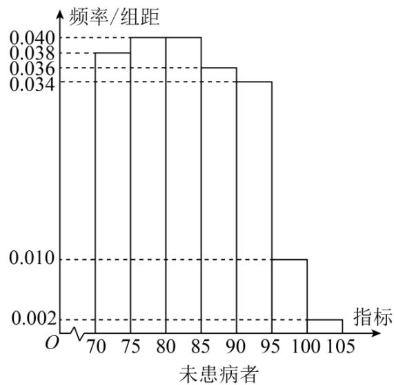

<!-- question-source:start -->
19. 某研究小组经过研究发现某种疾病的患病者与未患病者的某项医学指标有明显差异，经过大量调查，

得到如下的患病者和未患病者该指标的频率分布直方图：

利用该指标制定一个检测标准，需要确定临界值 $c$ ，将该指标大于 $c$ 的人判定为阳性，小于或等于 $c$ 的人判定为阴性．此检测标准的漏诊率是将患病者判定为阴性的概率，记为 $p(c)$ ；误诊率是将未患病者判定为阳性的概率，记为 $q(c)$ ．假设数据在组内均匀分布，以事件发生的频率作为相应事件发生的概率.
<!-- question-source:end -->

![[高中/真题/按年份分类/2023/精品解析_2023年新课标全国Ⅱ卷数学真题_解析版_/解答题/题目/answers/Q00029315A1.md]]
