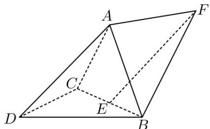

<!-- question-source:start -->
20. 如图，三棱锥 A - BCD 中，DA = DB = DC， $BD \perp CD$ ， $\angle ADB = \angle ADC = 60^{\circ}$ ，E 为 BC 的中点.

<!-- question-source:end -->

![[高中/真题/按年份分类/2023/精品解析_2023年新课标全国Ⅱ卷数学真题_解析版_/解答题/题目/answers/Q00029316A1.md]]
