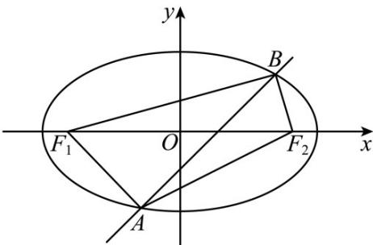

> [!faq]- 精品解析：2023年新课标全国Ⅱ卷数学真题（解析版）解析
>
> > [!success]- **【答案】** C
>
> > [!note]- **【分析】**
> > 首先联立直线方程与椭圆方程，利用 $\Delta > 0$ ，求出 $m$ 范围，再根据三角形面积比得到关于 $m$ 的方程，解出即可.
>
> > [!note]- **【解析】**
> > 将直线 $y = x + m$ 与椭圆联立 $\left\{ \begin{array}{l} y = x + m \\ \frac{x^2}{3} + y^2 = 1 \\ y = 4x^2 + 6mx + 3m^2 - 3 = 0 \end{array} \right.$ 因为直线与椭圆相交于 $A, B$ 点，则 $\Delta = 36m^2 - 4 \times 4(3m^2 - 3) > 0$ ，解得 $-2 < m < 2$ 设 $F_1$ 到 $AB$ 的距离 $d_1, F_2$ 到 $AB$ 距离 $d_2$ ，易知 $F_1(-\sqrt{2}, 0), F_2(\sqrt{2}, 0)$ ，则 $d_1 = \frac{[-\sqrt{2} + m]}{\sqrt{2}}$ ， $d_2 = \frac{|\sqrt{2} + m|}{\sqrt{2}}$ ， $\frac{S_{\triangle F_1AB}}{S_{\triangle F_2AB}} = \frac{[-\sqrt{2} + m]}{\frac{\sqrt{2}}{|\sqrt{2} + m|}} = \frac{[-\sqrt{2} + m]}{|\sqrt{2} + m|} = 2$ ，解得 $m = -\frac{\sqrt{2}}{3}$ 或（舍去），
> >
> > 故选：C.
> >
> > 
