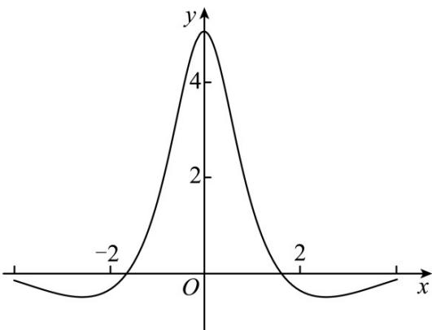

<!-- question-source:start -->
4. 函数 $f(x)$ 的图象如下图所示，则 $f(x)$ 的解析式可能为（）

A. $\frac{5\left(\mathrm{e}^{x}-\mathrm{e}^{-x}\right)}{x^{2}+2}$ B. $\frac{5\sin x}{x^2 + 1}$ C. $\frac{5\left(\mathrm{e}^{x}+\mathrm{e}^{-x}\right)}{x^{2}+2}$ D. $\frac{5\cos x}{x^2 + 1}$
<!-- question-source:end -->

![[高中/真题/按年份分类/2023/精品解析_2023年新高考天津数学高考真题_解析版_/一_选择题_在每小题给出的四个选项中_只有一项是符合题目要求的_/题目/answers/Q00020636A1.md]]
